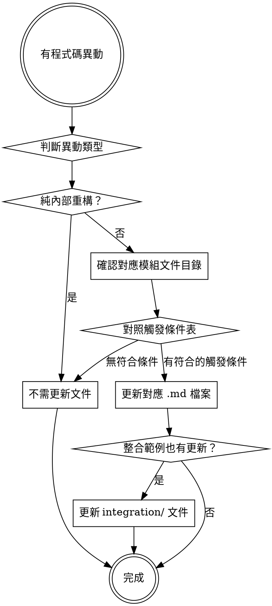

# sync-starters-docs

## Overview

在 `zipe-spring-boot-starters` 任何模組有程式碼異動時，用此 skill 確認文件是否需要同步更新。文件站台位於 `doc-site/docs/`，以 Docusaurus 為基礎。

## 文件結構對應

```
doc-site/docs/
├── base-starter/         ← base-spring-boot-starter 變更
├── db-starter/           ← db-spring-boot-starter 變更
├── job-starter/          ← job-spring-boot-starter 變更
├── logon-starter/        ← logon-spring-boot-starter 變更
├── web-service-starter/  ← web-service-spring-boot-starter 變更
├── web-starter/          ← web-spring-boot-starter 變更
├── integration/          ← 整合範例 (starters_example) 有新功能時
└── example-kotlin/       ← Kotlin 範例 (example-kotlin) 有新功能時
```

每個模組目錄下有固定四個文件頁面：

| 檔案 | 用途 |
|---|---|
| `index.md` | 模組簡介、功能概述、主要類別總表 |
| `quickstart.md` | 快速上手步驟（引入依賴 → 設定 → 驗證） |
| `configuration.md` | 完整 `application.yml` 設定屬性參考 |
| `examples.md` | 實際程式碼範例 |

## 各模組觸發條件與更新規則

### base-starter — 通用工具
**觸發**：新增或修改任何 `util/` 下的工具類別（加解密、HTTP、文件、字串、日期等）

| 變更類型 | 需更新的文件 |
|---|---|
| 新增工具類別（Util） | `index.md`（加入主要類別表格）、`examples.md`（加入使用範例）、`quickstart.md`（如影響入門步驟） |
| 修改現有工具方法簽章 | `examples.md`（更新呼叫方式）、`configuration.md`（如有設定屬性異動） |
| 新增 AutoConfiguration Bean | `index.md`（更新功能說明）、`configuration.md`（加入對應設定） |

### db-starter — 資料庫連接
**觸發**：新增連線類型、新增 Annotation、修改 ThreadLocal/AOP 機制、調整 JDBC 封裝

| 變更類型 | 需更新的文件 |
|---|---|
| 新增資料來源切換方式 | `index.md`（更新特性）、`quickstart.md`（新增設定步驟）、`configuration.md`（新增屬性）、`examples.md`（新增範例） |
| 修改 `@DS` / `@DynamicDS` 行為 | `examples.md`（更新 Annotation 用法） |
| 調整 `BaseJDBC` / `SQL` / `Conditions` | `examples.md`（更新 API 用法） |
| 資料庫 schema 結構變更 | `configuration.md`（如影響設定方式）、`integration/scenario-db.md` |

### job-starter — 排程
**觸發**：新增排程類型或模式、修改 Quartz 設定結構、調整 Job 生命週期 API

| 變更類型 | 需更新的文件 |
|---|---|
| 新增排程執行模式 | `index.md`、`quickstart.md`、`examples.md`、`integration/scenario-job.md` |
| 修改排程設定屬性 | `configuration.md`（更新屬性表格與 yml 範例） |
| 修改 Job 管理 API | `examples.md` |

### logon-starter — 登入認證
**觸發**：新增登入方式（LDAP/DB/OAuth2）、修改 Spring Security 設定、資料庫 schema 異動

| 變更類型 | 需更新的文件 |
|---|---|
| 新增登入方式 | `index.md`（更新特性）、`quickstart.md`（新增設定流程）、`configuration.md`（新增屬性）、`examples.md` |
| 修改認證流程或 Filter | `examples.md`（更新使用方式） |
| 資料庫 schema 變更 | `configuration.md`（更新建表 SQL）、`quickstart.md`（更新前置步驟） |
| 自訂登入日誌介面異動 | `examples.md`（更新實作範例） |

### web-service-starter — SOAP WebService
**觸發**：程式碼有任何變更時，先判斷是否影響外部可見的 API 或設定

| 變更類型 | 需更新的文件 |
|---|---|
| 新增 CXF 端點設定方式 | `configuration.md`、`quickstart.md` |
| 新增攔截器或 Handler | `index.md`（特性說明）、`examples.md` |
| 修改 WSDL 產生方式或路徑 | `quickstart.md`（驗證步驟）、`examples.md` |
| 純內部重構（不影響 API/設定） | 不需更新文件 |

### web-starter — REST API 與網頁
**觸發**：新增 REST API 功能、新增視圖技術、修改 Filter/Interceptor 等影響外部的變更

| 變更類型 | 需更新的文件 |
|---|---|
| 新增 REST API 功能（Controller/響應格式） | `index.md`、`examples.md` |
| 新增視圖技術（JSP/Thymeleaf/其他） | `quickstart.md`（新增設定）、`configuration.md`、`examples.md` |
| 新增 Global Exception Handler | `examples.md` |
| 修改 CORS/Security 設定屬性 | `configuration.md` |
| 純內部重構 | 不需更新文件 |

### starters_example — 整合範例
**觸發**：任一 Starter 有新功能，且整合範例專案已加入對應示範時

| 變更類型 | 需更新的文件 |
|---|---|
| 新增使用某 Starter 的範例程式碼 | `integration/index.md`（更新功能清單）、對應 `integration/scenario-*.md` |
| 新增整合情境 | 新增 `integration/scenario-<name>.md`，並更新 `integration/index.md` |
| 修改啟動流程或設定檔結構 | `integration/index.md`（目錄結構說明、啟動步驟） |

### example-kotlin — Kotlin 整合範例
**觸發**：example-kotlin 的 Kotlin 程式碼、`build.gradle.kts` 依賴/版本、資源設定或啟動方式有異動（它與 `starters_example` 功能對齊，是其 Kotlin 對應版）

| 變更類型 | 需更新的文件 |
|---|---|
| 新增/修改 Kotlin 範例程式（對齊 starters_example 的功能） | `example-kotlin/index.md`（目錄結構、涵蓋情境）、必要時連動 `integration/` 對應情境 |
| `build.gradle.kts` 升級（Spring Boot / Kotlin / Gradle / starter 版本）、依賴增減 | `example-kotlin/quickstart.md`（環境需求、依賴步驟）、`example-kotlin/kotlin-notes.md`（建構設定、版本對照表） |
| 與 starters_example 的語言/寫法差異有變（測試框架、Lombok、Entity 寫法等） | `example-kotlin/kotlin-notes.md`（差異對照表） |
| 啟動方式、context-path、驗證端點變更 | `example-kotlin/quickstart.md`（啟動步驟、端點表） |

> 注意：`example-kotlin` 與 `starters_example` 功能對齊。若兩者同時異動，需同步 `example-kotlin/` 與 `integration/` 兩處文件。

## 判斷流程



## 文件更新規範

- **語言**：繁體中文（台灣用語），程式碼、類別名稱、設定鍵值保持原始英文
- **程式碼區塊**：Java 用 `java`、YAML 用 `yaml`、XML 用 `xml`
- **`index.md` 主要類別表格**：新增類別時，在表格新增一行，說明職責（不超過 20 字）
- **`examples.md` 範例**：每個範例需有說明段落（1-2 句）加上完整可執行的程式碼片段
- **`configuration.md` 屬性表**：欄位包含「屬性鍵」、「預設值」、「說明」

## 不需要更新文件的情況

- 純粹修復 Bug，且 API / 設定 / 行為完全不變
- 修改測試程式碼
- 調整日誌輸出格式（不影響設定）
- 版本號 / 依賴版本升級（除非有 Breaking Change）
