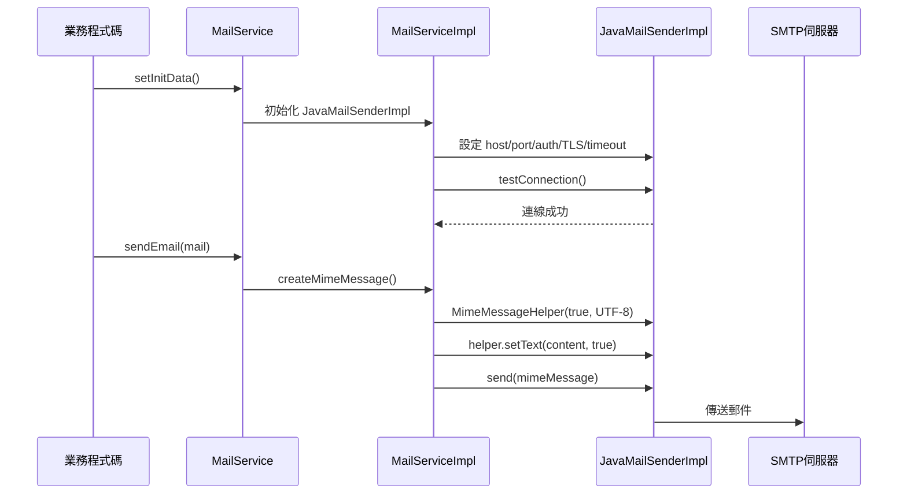

# 架構與開發指南

本文件面向需要深入了解 `base-spring-boot-starter` 內部結構的開發人員，包含模組設計理念、套件結構、核心類別說明、協作流程、自動配置原理，以及擴充與維護指南。

---

## 1. 模組定位與設計理念

`base-spring-boot-starter` 是整個 Starter 集合的**共用基礎層**，其他 Starter（`db`、`logon`、`web` 等）均可依賴此模組的工具類別。

### 設計目標

| 目標 | 說明 |
|---|---|
| **開箱即用** | 引入 JAR 後，Spring Boot 自動完成 Bean 裝配，無需任何 `@Import` 或 `@ComponentScan` |
| **零侵入** | 所有 Bean 均可被引用方覆蓋（透過 `allow-bean-definition-overriding: true`），不強制特定行為 |
| **工具靜態化** | 無狀態工具（加解密、字串、日期）全部以靜態方法提供，降低注入成本 |
| **策略可替換** | 加解密透過 `Crypto` 介面隔離演算法，`CryptoUtil` 以策略模式委派，新增演算法不需改動既有程式碼 |
| **Bean 數量最小化** | 只有具狀態且需要外部設定的元件才以 Spring Bean 形式存在（`MailService`、`VelocityUtil`、`ThreadPoolTaskExecutor`、`ApplicationContextHelper`） |

---

## 2. 套件結構

```
base-spring-boot-starter/
├── pom.xml                                         # Maven 建構描述，版本 3.5.14.0
└── src/main/
    ├── java/com/zipe/
    │   ├── autoconfiguration/
    │   │   └── BaseAutoConfiguration.java          # @AutoConfiguration 入口，裝配所有核心 Bean
    │   ├── config/
    │   │   ├── MailPropertyConfig.java              # @ConfigurationProperties(prefix="mail")
    │   │   ├── ThreadPoolTaskExecutorConfig.java    # 執行緒池靜態常數 (CORE=5, MAX=1000)
    │   │   └── VelocityPropertyConfig.java          # @ConfigurationProperties(prefix="velocity")
    │   ├── model/
    │   │   └── Mail.java                            # 郵件資料模型
    │   ├── service/
    │   │   ├── MailService.java                     # 郵件服務介面（五種發送方法）
    │   │   └── impl/
    │   │       └── MailServiceImpl.java             # 整合 JavaMailSenderImpl 的實作
    │   └── util/
    │       ├── ApplicationContextHelper.java        # 靜態工具，從 Spring Context 取得 Bean
    │       ├── LdapUtil.java                        # LDAP 連線、查詢、分頁搜尋
    │       ├── MapUtils.java                        # groupingBy 支援 null key 的 Collector
    │       ├── VelocityUtil.java                    # Velocity 模板引擎（四種載入模式）
    │       ├── YamlPropertySourceFactory.java       # 讓 @PropertySource 可引用 .yml 檔
    │       ├── bean/
    │       │   ├── BeanUtil.java                    # Bean 複製、JSON 序列化（Gson + Jackson）
    │       │   ├── DateSerializer.java              # Jackson Date 序列化器（yyyy/MM/dd HH:mm:ss）
    │       │   ├── EnumAdapterFactory.java          # Gson Enum → 含 value 物件
    │       │   └── LowerCaseKeyDeserializer.java    # Jackson Map key 首字母小寫
    │       ├── classloader/
    │       │   ├── CustomClassLoader.java           # URLClassLoader，動態載入外部 JAR
    │       │   ├── FileClassLoader.java             # ClassLoader，從目錄讀取 .class 檔
    │       │   └── JarClassLoader.java              # URLClassLoader，指定套件強制從 JAR 重新載入
    │       ├── crypto/
    │       │   ├── Crypto.java                      # 加解密介面（getEncrypt / getDecode）
    │       │   ├── CryptoUtil.java                  # 策略模式門面，委派給 Crypto 實作
    │       │   ├── AesUtil.java                     # AES-128/CBC/PKCS5Padding，隨機 IV，支援文字與檔案
    │       │   ├── Base64Util.java                  # Base64 編解碼
    │       │   ├── DESedeUtil.java                  # 3DES/CBC/PKCS5Padding，隨機 IV（淘汰演算法）
    │       │   ├── HexUtil.java                     # byte[] ↔ Hex 字串互轉
    │       │   └── Md5Util.java                     # MD5 雜湊（已棄用，禁用於密碼/簽章）
    │       ├── doc/
    │       │   ├── ExcelCell.java                   # 欄位 Annotation（排序、預設值、驗證）
    │       │   ├── ExcelLog.java                    # 匯入單行錯誤記錄
    │       │   ├── ExcelLogs.java                   # 匯入錯誤集合（含 hasError 旗標）
    │       │   ├── ExcelSheet.java                  # 多 Sheet 匯出 VO
    │       │   ├── ExcelUtil.java                   # Excel 匯入/匯出核心（xls/xlsx、多 API）
    │       │   ├── FieldForSortting.java            # 反射輔助 VO（Field + 排序索引）
    │       │   └── JasperReportUtil.java            # JasperReports PDF 產生工具
    │       ├── file/
    │       │   └── FileUtil.java                    # Apache Commons IO 封裝
    │       ├── http/
    │       │   └── OkHttpUtil.java                  # OkHttp 3 單例門面（同步/非同步 GET/POST）
    │       ├── print/
    │       │   ├── PrintContent.java                # 列印內容 VO（文字、座標、字體）
    │       │   └── PrintUtils.java                  # Java AWT 列印（實作 Printable）
    │       ├── string/
    │       │   ├── CommonStringUtil.java            # 數字格式化、補零、中文截取、首字母小寫
    │       │   ├── RandomUtil.java                  # SecureRandom 亂數字串
    │       │   └── StringConstant.java              # 系統常用字串常數
    │       ├── time/
    │       │   └── DateTimeUtils.java               # Java 8 日期工具（18 個 Formatter、民國年）
    │       └── validation/
    │           ├── RegexUtils.java                  # 正規表達式靜態驗證（Email/手機/IP/URL）
    │           └── Validation.java                  # 正規表達式常數庫 + 台灣身分證演算法
    └── resources/
        ├── META-INF/spring/
        │   └── org.springframework.boot.autoconfigure.AutoConfiguration.imports
        ├── application.yml                          # 預設值（allow-bean-definition-overriding=true）
        └── resource.properties                      # velocity.dir-path=template
```

### 套件職責說明

| 套件 | 職責 |
|---|---|
| `autoconfiguration` | Spring Boot 自動配置入口，無需使用者手動宣告任何 Bean |
| `config` | 屬性綁定 POJO，讀取 `mail.*` 與 `velocity.*` 前綴的設定 |
| `model` | 郵件業務物件 |
| `service / impl` | 郵件發送業務邏輯，隔離 JavaMail 實作細節 |
| `util/bean` | JSON 序列化 / Bean 屬性複製，雙引擎（Gson + Jackson），含自訂 Enum 與 Date 處理 |
| `util/classloader` | 執行期動態載入外部 `.class` 或 JAR，用於外掛 / 熱更新場景 |
| `util/crypto` | 策略模式加解密體系：AES-128、3DES、Base64、MD5、Hex |
| `util/doc` | Excel（Apache POI）匯入 / 匯出 與 JasperReports PDF 產生 |
| `util/file` | 封裝 Apache Commons IO，簡化檔案增刪改查操作 |
| `util/http` | OkHttp 3 HTTP 客戶端，單例設計，支援同步與非同步請求 |
| `util/print` | Java AWT 本地列印，支援多頁、指定印表機、座標定位 |
| `util/string` | 字串常數、格式化、補位、中英文混排截取、SecureRandom 亂數 |
| `util/time` | Java 8 `java.time` 日期工具，含台灣民國年 / 西元年互轉 |
| `util/validation` | 正規表達式驗證庫，含台灣身分證字號完整演算法驗證 |

---

## 3. 核心類別詳解

### 3.1 `BaseAutoConfiguration`

**職責：** 整個 Starter 的唯一自動配置入口，將所有具狀態的基礎 Bean 注入 Spring Context。

| 方法 / Bean | 說明 |
|---|---|
| `messageSource()` | `@ConditionalOnResource(resources="classpath:message.properties")`；引用方若有此檔才建立，UTF-8 編碼，可熱重載 |
| `applicationContextHelper()` | 注入 `ApplicationContextHelper`，完成靜態 `applicationContext` 欄位的賦值 |
| `velocityUtil()` | 讀取 `VelocityPropertyConfig.dirPath`，以 classpath loader 模式初始化 Velocity |
| `mailService()` | 以 `MailPropertyConfig` 建立 `MailServiceImpl`；**使用郵件功能前必須先呼叫 `setInitData()`** |
| `serviceJobTaskExecutor` | 名稱為 `threadPoolTaskExecutor` 的執行緒池；coreSize=5, maxSize=1000, queue=200, keepAlive=30000s |

---

### 3.2 `MailService` / `MailServiceImpl`

**職責：** 封裝所有郵件發送邏輯，支援五種情境。

| 方法 | 說明 | 使用時機 |
|---|---|---|
| `setInitData()` | 初始化 `JavaMailSenderImpl`，驗證 SMTP 連線；`encryptEnable=true` 時以 Base64 解碼密碼 | **每次使用前必須先呼叫一次** |
| `simpleMailSend(mail)` | 最輕量，純文字，無附件 | 系統內部通知、純文字警報 |
| `sendEmail(mail)` | 支援 HTML content，可設定 To / CC | 一般 HTML 格式郵件 |
| `attachedSend(mail)` | 多附件，`MimeMessageHelper.addAttachment()` | 需要附件但不含 HTML 內文 |
| `richContentSend(mail)` | HTML 內文 + 附件 | 精美格式報表 + 附件 |
| `sendBatchMailWithFile(mail)` | 多收件人 + 多附件，自行組裝 `MimeMultipart`；以 `MimeUtility.encodeText()` 防中文亂碼 | 批次寄送，大量收件人 |

**`Mail` 物件欄位：**

| 欄位 | 型別 | 說明 |
|---|---|---|
| `mailFrom` | `String` | 寄件者（若未設定則取 `MailPropertyConfig.sender`） |
| `mailTo` | `String[]` | 主要收件人 |
| `mailCc` | `String[]` | 副本收件人 |
| `mailBcc` | `String[]` | 密件副本 |
| `mailSubject` | `String` | 主旨 |
| `mailContent` | `String` | 郵件內文 |
| `contentType` | `String` | 預設 `"text/plain"`；HTML 郵件改為 `"text/html"` |
| `attachments` | `List<File>` | 附件清單 |

---

### 3.3 `VelocityUtil`

**職責：** 封裝 Velocity 模板引擎，提供四種 ResourceLoader 初始化方式。

| 方法 | 說明 |
|---|---|
| `initClassPath()` | 使用 `ClasspathResourceLoader`（**預設**，由 `BaseAutoConfiguration` 呼叫） |
| `initFilePath()` | 使用 `FileResourceLoader` |
| `initFileSystemPath(path)` | 指定檔案系統絕對路徑；為空時 fallback 到 `resourcePath` 或 `template/` |
| `initWebPath(request, path)` | WebApp loader，適用 Servlet 環境 |
| `generateContent(templateName, map)` | 以 Map 填入 VelocityContext，merge 後回傳 HTML 字串 |
| `writeTemplateOutput(templateName, outputFile, map)` | 呼叫 `generateContent` 後寫入檔案，UTF-8，1 MB 緩衝 |
| `close()` | 將 `ve` 設為 null 釋放引用（Velocity 1.7 無 close() 方法，GC 後釋放） |

**初始化模式比較：**

| 模式 | 適用情境 | 樣板存放位置 |
|---|---|---|
| `initClassPath()` | 一般 Spring Boot 應用（**預設**） | `src/main/resources/<dirPath>/` |
| `initFilePath()` | 需要在執行期更新樣板，不重新部署 | 伺服器本地目錄 |
| `initFileSystemPath(path)` | 多應用共用樣板目錄 | 絕對路徑目錄 |
| `initWebPath()` | 傳統 WAR 部署 Servlet 環境 | WebApp 根目錄下的相對路徑 |

---

### 3.4 `AesUtil`

**職責：** AES-128/CBC/PKCS5Padding 加解密，支援字串與檔案。

| 方法 | 說明 |
|---|---|
| `getEncrypt(content, charset)` | 產生隨機 16-byte IV 加密，回傳 `Base64(IV ‖ ciphertext)`；**secretKey 必須恰好 16 bytes** |
| `getDecode(content, charset)` | 先 Base64 decode，取前 16 bytes 還原 IV 再 AES decrypt |
| `encryptFile(source, target)` | `CipherInputStream` 串流加密，輸出檔開頭寫入 16-byte IV |
| `decryptFile(source, target)` | 讀取檔首 16-byte IV 後以 `CipherOutputStream` 串流解密 |
| `decryptFile(source)` | 解密後回傳 `ByteArrayInputStream`，適合記憶體中繼續使用 |
| `checkPath(source, target)` | 校驗來源存在、目標與來源不同、自動建立目標父目錄 |

:::warning secretKey 限制與密文相容性
`AesUtil` 使用 AES-128，**secretKey 必須恰好 16 bytes（16 個 ASCII 字元）**，長度不符會立即拋出 `RuntimeException`。加密改為**每次隨機 IV**並將 IV 前綴於密文，因此相同明文每次密文不同；**舊版（固定 IV、無前綴）加密的資料與本版不相容**，需重新加密。
:::

---

### 3.5 `BeanUtil`

**職責：** 抽象類別，繼承 Spring `BeanUtils`，整合 Gson + Jackson，提供跨框架的 Bean / JSON 操作。

| 方法 | 說明 |
|---|---|
| `copyProperties(source, target)` | 覆寫 Spring 版本，**跳過 null 值欄位**（原版會覆蓋為 null） |
| `copyList(froms, clazz)` | 批次複製 List，對每個元素呼叫 `copyProperties` |
| `toMap(o)` | Jackson `ObjectMapper.convertValue` → `Map<String, Object>` |
| `toJson(src)` | Gson 序列化；Date → timestamp（long）；Enum → 含 value 物件；null 值保留 |
| `fromJson(json, clazz)` | Gson 反序列化為指定類型 |
| `fromJsonToList(json, clazz)` | Gson 反序列化為泛型 `List<T>`，使用 `ParameterizedType` 包裝 |
| `fromJson(json)` | Jackson 反序列化 → `Map<String, Object>`，Map key 自動首字母小寫 |

:::note copyProperties 行為差異
`BeanUtil.copyProperties` 跳過 null 值，適合「合併更新」情境（保留目標物件的既有值）。若業務需要「強制清空某欄位」，請改用 Spring 原版 `BeanUtils.copyProperties`。
:::

---

### 3.6 `ExcelUtil`

**職責：** Apache POI Excel 讀寫核心工具，支援 xls / xlsx，支援多 Sheet。

**匯出 API 總覽：**

| 方法簽名 | 格式 | 說明 |
|---|---|---|
| `exportExcel(sheetName, dataset, file, isAddSheet)` | xlsx | 支援在既有檔案新增 Sheet；以 `_param=xxx_` 字串作為樣式控制指令 |
| `exportExcel(headers, dataset, out)` | xls | 舊式多 Sheet，以 `Map<Integer, Map<Integer, String>>` 定義 header |
| `exportExcel(headers, dataset, out [, pattern])` | xls | 單 Sheet，`Map<String,String>` header，反射讀取 `@ExcelCell(index)` |
| `exportExcel(String[][], out [, autoColumnWidth])` | xls | 最簡單版，直接二維字串陣列 |
| `exportExcel(List<ExcelSheet<T>>, out [, pattern])` | xls | 泛型多 Sheet，以 `ExcelSheet` VO 封裝 |

**匯入 API：**

| 方法簽名 | 說明 |
|---|---|
| `importExcel(file, clazz, pattern, logs, arrayCount...)` | 依副檔名自動選 xls / xlsx；以 `@ExcelCell` 對應欄位；支援驗證規則（allowNull / in / gt / lt）；錯誤記錄於 `ExcelLogs` |

**`@ExcelCell` Annotation 屬性：**

| 屬性 | 說明 |
|---|---|
| `index` | 欄位對應的 Excel 欄位索引（從 0 開始） |
| `defaultValue` | 儲存格空白時的預設值 |
| `allowNull` | 是否允許空白（預設 `true`） |
| `in` | 允許的值清單 |
| `gt` / `lt` / `ge` / `le` | 數值大小驗證 |

:::caution exportExcel 特殊控制字串
`exportExcel(sheetName, dataset, file, isAddSheet)` 使用資料集合中特殊字串作為樣式控制指令，例如 `_param=header_`、`_param=body_`、`_param=footer_`。這些常數定義在 `StringConstant` 中，維護時請注意資料集合內不能混入這類控制字串。
:::

---

### 3.7 `OkHttpUtil`

**職責：** OkHttp 3 的單例門面，使用 JDK 平台預設的 TLS 信任鏈與主機名稱驗證。

| 方法 | 類型 | 說明 |
|---|---|---|
| `getInstance()` | - | 單例，延遲初始化 |
| `getData(url)` | 同步 GET | 回傳 Response body 字串 |
| `postData(url, bodyParams)` | 同步 POST | Form 表單編碼 |
| `postJson(url, json)` | 同步 POST | JSON body |
| `postXml(url, xml)` | 同步 POST | XML body |
| `getDataAsyn(url, netCall)` | 非同步 GET | 結果透過 `NetCall` 回調 |
| `postDataAsyn(url, bodyParams, netCall)` | 非同步 POST | Form 表單編碼 |
| `postJsonAsyn(url, json, netCall)` | 非同步 POST | JSON body |

:::info TLS 憑證驗證
自此版本起，`OkHttpUtil` 已**移除**先前停用 TLS 驗證的 `TrustAllCerts` 與恆為 true 的 hostnameVerifier，改用 JDK 平台預設信任鏈，可正常抵禦中間人攻擊。若連線目標為自簽憑證，請改以載入指定 CA 或憑證綁定（pinning）方式處理，**切勿**停用憑證或主機名稱驗證。
:::

---

### 3.8 `DateTimeUtils`

**職責：** Java 8 `java.time` 日期工具，時區固定為 UTC+8，提供 18 個預定義 `DateTimeFormatter`。

| 分類 | 方法 |
|---|---|
| 取得當下 | `getDateNow()` → LocalDateTime（UTC+8）；`getDateNow(formatter)` → String |
| 加減 | `getMinusOrPlusYears/Months/Weeks/Days/Hours/Minutes/Seconds(offset, formatter)` |
| 型別轉換 | `DateToJava8Date(date, type)`、`Java8DateToDate(java8Date)`、`localDateTimeToDate` 等 |
| 邊界 | `currentMin/Max(date)`、`currentFirstDayOfMonth`、`preXDayOfMonthMin/MAX` |
| 差值 | `getUntilMonth/Day/Hours/Second(date1, date2)`、`getUntilHoursByDouble` |
| 台灣民國年 | `getMinguoYear()`、`getMinguoYearIfJanuary()`、`transferADDateToMinguoDate(yyyyMM)`、`transferMinguoDateToADDate(yyyMMdd)` |

:::note 時區硬編碼
`getDateNow()` 固定使用 `ZoneOffset.of("+8")`。部署至非台灣時區的環境時，請注意此行為或改用 `ZoneId.systemDefault()`。
:::

---

### 3.9 `LdapUtil`

**職責：** LDAP 連線工具，支援登入驗證、使用者查詢、分頁取得全部使用者 / 群組。

| 方法 | 說明 |
|---|---|
| `getLdapContext()` | 建立 `InitialLdapContext`，Simple 認證，`referral=follow` |
| `loginLdap()` | 以 sAMAccountName 查詢使用者屬性（DN / sn / mail / telephone 等） |
| `getLdapAllUsersInfo()` | 取得所有 `objectClass=user`，分頁 10 筆 |
| `getLdapAllGroupsInfo()` | 取得所有 `objectClass=group`，分頁 10 筆 |
| `getAllInfoByObjectClass(objectClass)` | 通用分頁查詢，完成後自動呼叫 `closeConnection()` |
| `closeConnection()` | 關閉 LdapContext |

:::warning 連線洩漏風險
`loginLdap()` **不會**自動關閉 LDAP 連線，呼叫端使用完畢後必須手動呼叫 `closeConnection()`，否則會造成連線洩漏。建議使用 `try-finally` 包覆。
:::

---

### 3.10 `ApplicationContextHelper`

**職責：** 讓非 Spring 管理的物件（靜態工具類、舊式元件）能取得 Spring Bean。

| 方法 | 說明 |
|---|---|
| `getBean(beanName)` | 依名稱取得 Bean；context 為 null 時拋出 `NullPointerException` |
| `popBean(Class<T>)` | 依型別取得 Bean；context 為 null 時回傳 null（不拋例外） |
| `popBean(name, Class<T>)` | 依名稱 + 型別取得 Bean |

---

### 3.11 `PrintUtils`

**職責：** 實作 `java.awt.print.Printable`，支援多頁文字列印、指定印表機名稱、座標定位。

**正確使用順序：**

1. 呼叫 `setContentMap(pageIndex, List<PrintContent>)` 設定每頁內容
2. 呼叫 `setJobName(name)` 設定列印工作名稱
3. 呼叫 `setPrinterName(name)` 設定目標印表機（不設定則使用系統預設）
4. 呼叫 `initJob()` 建立 `PrinterJob`，自動讀取印表機實際紙張尺寸
5. 呼叫 `doPrint()` 啟動列印

---

### 3.12 ClassLoader 三件套

| 類別 | 繼承 | 使用時機 |
|---|---|---|
| `FileClassLoader` | `ClassLoader` | 從指定目錄讀取 `.class` 檔案位元組，呼叫 `defineClass` 動態定義 |
| `CustomClassLoader` | `URLClassLoader` | 動態載入外部 JAR；`unloadJarFile()` 關閉 JarFile 資源以允許在 Windows 上刪除 / 替換 JAR |
| `JarClassLoader` | `URLClassLoader` | 對 `appliedPackages` 中的套件強制從 JAR 重新載入（繞過雙親委派），適用於熱更新或外掛場景；`loadClass` 加 `synchronized` 防並發衝突 |

**`JarClassLoader` 使用重點：**
- 呼叫 `addAppliedPackages(packageName)` 設定需要強制重新載入的套件前綴
- 只有符合 `appliedPackages` 的類別才繞過雙親委派，其餘類別仍由父 ClassLoader 處理

---

## 4. 核心協作流程

### 4.1 發送 HTML 郵件



### 4.2 Velocity 模板產生郵件內文

以下流程說明如何用 VelocityUtil 渲染模板並組合進郵件：

1. 業務程式碼注入 `@Autowired VelocityUtil velocityUtil`
2. 建立 `Map<String, Object> model`，放入模板變數
3. 呼叫 `velocityUtil.generateContent("mail/welcome.vm", model)`
   - `VelocityUtil` 從 classpath 的 `template/mail/welcome.vm` 讀取模板
   - 建立 `VelocityContext`，將 map 內容放入
   - 呼叫 `template.merge(context, writer)`，回傳 HTML 字串
4. 將回傳的 HTML 設定到 `mail.setMailContent(html)`
5. 呼叫 `mailService.sendEmail(mail)` 發送

### 4.3 Excel 匯入並驗證

```
業務程式碼
  → ExcelLogs logs = new ExcelLogs()
  → Collection<MyBean> result = ExcelUtil.importExcel(excelFile, MyBean.class, "yyyy-MM-dd", logs)
       ExcelUtil
         → 依副檔名自動選 HSSFWorkbook (xls) 或 XSSFWorkbook (xlsx)
         → sheet.rowIterator()：第 0 行略過（標題行）
         → 每一 data row：
              sortFieldByAnno(MyBean.class)  // 依 @ExcelCell(index) 排序欄位
              for each field:
                validateCell(cell, field)     // 型別、allowNull、in/gt/lt 驗證
                getCellValue(cell)            // 依 CellType 取值
                field.set(t, value)           // 反射寫入 Bean
         → logs.setLogList(logList)
  → if (logs.getHasError()) { 顯示錯誤訊息 }
```

### 4.4 OkHttp 非同步呼叫外部 API

```
業務程式碼
  → OkHttpUtil.getInstance().postJsonAsyn(url, json, new OkHttpUtil.NetCall() {
        onResponse(call, response) → 處理回應
        onFailed(call, e)          → 記錄錯誤
    })
    OkHttpUtil (singleton)
      → getOkHttpClient()   // 懶初始化（synchronized）：平台預設 TLS，read=100s, connect=60s
      → RequestBody.create(json, JSON MediaType)
      → new Request.Builder().url(...).post(body).build()
      → client.newCall(request).enqueue(callback)  // OkHttp 內部執行緒執行
```

### 4.5 執行緒池提交任務

```
業務程式碼
  → @Autowired ThreadPoolTaskExecutor threadPoolTaskExecutor
  → Future<String> future = threadPoolTaskExecutor.submit(callable)
       ThreadPoolTaskExecutor (core=5, max=1000, queue=200)
         → 活躍執行緒 < coreSize：建立新執行緒
         → 活躍執行緒 >= coreSize：放入 LinkedBlockingQueue(200)
         → queue 滿且執行緒 < maxSize：建立新執行緒
  → String result = future.get()  // 阻塞等待
```

---

## 5. 自動配置運作原理

### 5.1 AutoConfiguration.imports 登錄

```
src/main/resources/META-INF/spring/
  org.springframework.boot.autoconfigure.AutoConfiguration.imports
```

檔案內容僅一行：

```
com.zipe.autoconfiguration.BaseAutoConfiguration
```

這是 **Spring Boot 3.x 的自動配置機制**（取代 Spring Boot 2.x 的 `spring.factories`）。應用啟動時，`AutoConfigurationImportSelector` 掃描 classpath 上所有 JAR 的此檔案，自動將 `BaseAutoConfiguration` 加入 Configuration 候選。

### 5.2 類別層級的條件裝配

```java
@AutoConfiguration
@PropertySource({"classpath:resource.properties"})
@ConditionalOnClass({VelocityPropertyConfig.class, MailPropertyConfig.class})
@EnableConfigurationProperties({VelocityPropertyConfig.class, MailPropertyConfig.class})
public class BaseAutoConfiguration { ... }
```

| 元素 | 作用 |
|---|---|
| `@AutoConfiguration` | Spring Boot 3 專用注解，確保在引用方的 `@Configuration` 之後執行 |
| `@PropertySource("classpath:resource.properties")` | 載入 Starter 內建預設值（`velocity.dir-path=template`） |
| `@ConditionalOnClass(...)` | 兩個 Config 類位於 Starter JAR 中，幾乎永遠成立，主要作為 classpath 守衛 |
| `@EnableConfigurationProperties` | 啟用 `@ConfigurationProperties` 綁定，讓 Config 類可被注入 |

### 5.3 Bean 層級的條件裝配

只有 `messageSource()` 使用了條件注解：

```java
@Bean
@ConditionalOnResource(resources = "classpath:message.properties")
public MessageSource messageSource() { ... }
```

**含義：** 引用方的 classpath 有 `message.properties` 才建立此 Bean。若引用方沒有此檔，Spring Context 中不會有 `messageSource` Bean，這也是部分引用方找不到 `MessageSource` Bean 的原因。

其餘四個 Bean（`applicationContextHelper`、`velocityUtil`、`mailService`、`threadPoolTaskExecutor`）**無條件裝配**，引入 Starter 後一定會出現在 Context 中。

### 5.4 覆蓋 Starter 的 Bean

`starter 內建的 application.yml` 設定了：

```yaml
spring:
  main:
    allow-bean-definition-overriding: true
```

這表示引用方可以宣告**同名 Bean** 來覆蓋 Starter 的預設實作。例如，自訂執行緒池大小：

```java
@Configuration
public class MyThreadPoolConfig {
    @Bean(name = "threadPoolTaskExecutor")  // 與 Starter 同名，會覆蓋之
    public ThreadPoolTaskExecutor customExecutor() {
        ThreadPoolTaskExecutor executor = new ThreadPoolTaskExecutor();
        executor.setCorePoolSize(10);
        executor.setMaxPoolSize(50);
        executor.setQueueCapacity(500);
        return executor;
    }
}
```

### 5.5 屬性優先級

```
引用方 application.yml / application.properties
  > Starter 的 resource.properties（透過 @PropertySource 載入）
  > Starter 的 application.yml（僅在 Starter 本身執行時有效，引用後通常被引用方覆蓋）
```

---

## 6. 開發擴充指南

### 範例 A：新增一個新的加密演算法（RSA）

此範例展示如何遵循 `Crypto` 介面的策略模式新增演算法，**不需要修改任何現有程式碼**。

**步驟 1：** 在 `util/crypto/` 建立 `RsaUtil.java`，實作 `Crypto` 介面：

```java
package com.zipe.util.crypto;

import javax.crypto.Cipher;
import java.security.*;
import java.util.Base64;

public class RsaUtil implements Crypto {

    private final String publicKey;
    private final String privateKey;

    public RsaUtil(String publicKey, String privateKey) {
        this.publicKey = publicKey;
        this.privateKey = privateKey;
    }

    @Override
    public String getEncrypt(String content) {
        return getEncrypt(content, "UTF-8");
    }

    @Override
    public String getEncrypt(String content, String charset) {
        try {
            byte[] keyBytes = Base64.getDecoder().decode(publicKey);
            PublicKey pub = KeyFactory.getInstance("RSA")
                    .generatePublic(new java.security.spec.X509EncodedKeySpec(keyBytes));
            Cipher cipher = Cipher.getInstance("RSA/ECB/PKCS1Padding");
            cipher.init(Cipher.ENCRYPT_MODE, pub);
            return Base64.getEncoder().encodeToString(cipher.doFinal(content.getBytes(charset)));
        } catch (Exception e) {
            throw new RuntimeException("RsaUtil: encrypt fail!", e);
        }
    }

    @Override
    public String getDecode(String content) {
        return getDecode(content, "UTF-8");
    }

    @Override
    public String getDecode(String content, String charset) {
        try {
            byte[] keyBytes = Base64.getDecoder().decode(privateKey);
            PrivateKey priv = KeyFactory.getInstance("RSA")
                    .generatePrivate(new java.security.spec.PKCS8EncodedKeySpec(keyBytes));
            Cipher cipher = Cipher.getInstance("RSA/ECB/PKCS1Padding");
            cipher.init(Cipher.DECRYPT_MODE, priv);
            return new String(cipher.doFinal(Base64.getDecoder().decode(content)), charset);
        } catch (Exception e) {
            throw new RuntimeException("RsaUtil: decrypt fail!", e);
        }
    }
}
```

**步驟 2：** 呼叫端透過 `CryptoUtil` 組合使用：

```java
CryptoUtil rsaCrypto = new CryptoUtil(new RsaUtil(publicKey, privateKey));
String encrypted = rsaCrypto.encrypt("plaintext");
String decrypted = rsaCrypto.decrypt(encrypted);
```

**需要修改的檔案：** 僅新增 `RsaUtil.java`，無需改動其他任何類別。

---

### 範例 B：新增 OkHttp PUT 請求支援

在 `OkHttpUtil.java` 新增方法（所有方法共用 `getOkHttpClient()` 取得已配置的 client）：

```java
// 同步 PUT JSON
public String putJson(String url, String json) throws Exception {
    RequestBody body = RequestBody.create(json, JSON);
    Request request = new Request.Builder()
            .url(url)
            .put(body)
            .build();
    try (Response response = getOkHttpClient().newCall(request).execute()) {
        if (response.isSuccessful() && response.body() != null) {
            return response.body().string();
        }
        throw new IOException("Unexpected code " + response);
    }
}

// 非同步 PUT JSON
public void putJsonAsyn(String url, String json, NetCall netCall) {
    RequestBody body = RequestBody.create(json, JSON);
    Request request = new Request.Builder()
            .url(url)
            .put(body)
            .build();
    getOkHttpClient().newCall(request).enqueue(new Callback() {
        @Override
        public void onResponse(Call call, Response response) throws IOException {
            netCall.onResponse(call, response);
        }
        @Override
        public void onFailure(Call call, IOException e) {
            netCall.onFailed(call, e);
        }
    });
}
```

**需要修改的檔案：** 僅 `OkHttpUtil.java`。

---

### 範例 C：新增一個全新的工具類別

以新增 PDF 文字擷取工具為例，說明完整流程：

**步驟 1：** 在 `pom.xml` 加入依賴：

```xml
<dependency>
    <groupId>org.apache.pdfbox</groupId>
    <artifactId>pdfbox</artifactId>
    <version>3.0.2</version>
</dependency>
```

**步驟 2：** 在對應套件建立工具類（純靜態工具不需在 `BaseAutoConfiguration` 宣告 Bean）：

```java
package com.zipe.util.doc;

import org.apache.pdfbox.pdmodel.PDDocument;
import org.apache.pdfbox.text.PDFTextStripper;

import java.io.File;
import java.io.IOException;

public class PdfUtil {

    private PdfUtil() { }

    /**
     * 擷取 PDF 檔案的全文文字。
     *
     * @param pdfFile PDF 檔案
     * @return 擷取後的純文字字串
     */
    public static String extractText(File pdfFile) throws IOException {
        try (PDDocument document = PDDocument.load(pdfFile)) {
            PDFTextStripper stripper = new PDFTextStripper();
            return stripper.getText(document);
        }
    }
}
```

**步驟 3（選擇性）：** 若工具需要 Spring Bean 管理（例如注入設定），在 `BaseAutoConfiguration` 新增：

```java
@Bean
public PdfUtil pdfUtil() {
    return new PdfUtil();
}
```

**需要修改的檔案：** `pom.xml`（新依賴）、新增 `PdfUtil.java`，可選修改 `BaseAutoConfiguration.java`。

---

### 範例 D：讓執行緒池大小可由 application.yml 配置

**現況：** `ThreadPoolTaskExecutorConfig` 中的常數是靜態欄位，無法透過設定檔調整。

**步驟 1：** 修改 `ThreadPoolTaskExecutorConfig.java`，改為 `@ConfigurationProperties`：

```java
package com.zipe.config;

import lombok.Data;
import org.springframework.boot.context.properties.ConfigurationProperties;

@ConfigurationProperties(prefix = "thread-pool")
@Data
public class ThreadPoolTaskExecutorConfig {
    private int corePoolSize = 5;
    private int maxPoolSize = 1000;
    private int queueCapacity = 200;
    private int keepAliveSeconds = 30000;
}
```

**步驟 2：** 將 `ThreadPoolTaskExecutorConfig` 加入 `BaseAutoConfiguration` 的 `@EnableConfigurationProperties`：

```java
@EnableConfigurationProperties({VelocityPropertyConfig.class, MailPropertyConfig.class, ThreadPoolTaskExecutorConfig.class})
```

**步驟 3：** 修改 `serviceJobTaskExecutor()` 改從注入的 Config 讀取值：

```java
@Autowired
private ThreadPoolTaskExecutorConfig threadPoolConfig;

@Bean(name = "threadPoolTaskExecutor")
public ThreadPoolTaskExecutor serviceJobTaskExecutor() {
    ThreadPoolTaskExecutor poolTaskExecutor = new ThreadPoolTaskExecutor();
    poolTaskExecutor.setCorePoolSize(threadPoolConfig.getCorePoolSize());
    poolTaskExecutor.setMaxPoolSize(threadPoolConfig.getMaxPoolSize());
    poolTaskExecutor.setQueueCapacity(threadPoolConfig.getQueueCapacity());
    poolTaskExecutor.setKeepAliveSeconds(threadPoolConfig.getKeepAliveSeconds());
    poolTaskExecutor.setWaitForTasksToCompleteOnShutdown(true);
    return poolTaskExecutor;
}
```

引用方接著可在 `application.yml` 中自訂：

```yaml
thread-pool:
  core-pool-size: 10
  max-pool-size: 200
  queue-capacity: 500
  keep-alive-seconds: 60
```

**需要修改的檔案：**
- `ThreadPoolTaskExecutorConfig.java` — 改為 `@ConfigurationProperties`
- `BaseAutoConfiguration.java` — 調整 `@EnableConfigurationProperties` 與 `serviceJobTaskExecutor()` 方法

---

## 7. 維護注意事項與常見陷阱

### 7.1 執行緒安全問題

| 類別 / 欄位 | 問題描述 | 建議處置 |
|---|---|---|
| `ApplicationContextHelper.applicationContext` 靜態欄位 | 多個 ApplicationContext（如整合測試）時後建立的會覆蓋前者 | 測試環境注意 Context 隔離 |
| `OkHttpUtil` 單例初始化 | `getOkHttpClient()` 已加上 `synchronized`，避免高並發下重複建立 client | 已處理 |
| `FileClassLoader.findClass()` | 無 `synchronized`，多執行緒並發可能造成 `defineClass()` race condition | 需要並發載入時改用 `JarClassLoader` |
| `Validation.StrisNull()` | 有不必要的 `synchronized`，純讀取操作同步造成效能瓶頸 | 可移除 `synchronized` |

### 7.2 資源釋放問題

| 類別 | 問題 | 處置方式 |
|---|---|---|
| `LdapUtil.loginLdap()` | 不自動關閉連線 | 呼叫端 `try-finally` 中手動呼叫 `closeConnection()` |
| `OkHttpUtil` | `OkHttpClient` 包含的執行緒池在 JVM 關閉時不會自動結束 | 在 `@PreDestroy` 中呼叫 `client.dispatcher().executorService().shutdown()` 與 `client.connectionPool().evictAll()` |
| `ExcelUtil.importExcel()` | `Workbook` 未在 `finally` 中關閉，大量匯入可能記憶體洩漏 | 已用 `@SuppressWarnings("resource")` 抑制警告，實際使用時建議改版加入 `workbook.close()` |

### 7.3 設計取捨與安全注意事項

| 設計 | 說明 |
|---|---|
| AES 隨機 IV | 已改為每次產生隨機 IV 並前綴於密文（`Base64(IV‖cipher)`）；舊版固定 IV 密文不相容，需重新加密 |
| OkHttp TLS 驗證 | 已移除 `TrustAllCerts`，改用平台預設信任鏈；自簽憑證請改用載入 CA 或 pinning，勿停用驗證 |
| 3DES 改用 CBC | `DESedeUtil` 由 ECB 改為 CBC＋隨機 IV；3DES 屬淘汰演算法，新專案建議改用 `AesUtil` |
| `Md5Util` 已棄用 | MD5 不可用於密碼或簽章；已標註 `@Deprecated` |
| `MailServiceImpl` 非 `@Service` | 由 `BaseAutoConfiguration` 以 `new` 建立後以 `@Bean` 加入 Context，不支援 `@Transactional` 等 Spring AOP 代理特性 |
| `DateTimeUtils` 硬編碼 UTC+8 | 非台灣時區部署需特別注意，或改為讀取 `ZoneId.systemDefault()` |
| `BeanUtil.copyProperties` 跳過 null | 適合合併更新；需要強制清空欄位時改用 Spring 原版 `BeanUtils.copyProperties` |
| `ExcelUtil` 使用廢棄 `clazz.newInstance()` | Java 9 後已標記 `@Deprecated`，應改用 `clazz.getDeclaredConstructor().newInstance()` |
| `ThreadPoolTaskExecutorConfig` 常數為 `public static int`（非 `final`） | 執行期可被任意修改，但不影響已初始化的執行緒池；建議改為 `private static final` |

### 7.4 常見使用陷阱

**陷阱 1：忘記呼叫 `mailService.setInitData()`**

郵件服務由 `BaseAutoConfiguration` 建立時，`mailSender` 欄位為 `null`。**每次使用郵件服務前必須先呼叫一次 `setInitData()`**，否則會拋出 `NullPointerException`。建議在服務啟動後（例如 `@PostConstruct`）統一初始化一次：

```java
@Service
public class NotificationService {
    @Autowired
    private MailService mailService;

    @PostConstruct
    public void init() throws MessagingException {
        mailService.setInitData(); // 啟動時驗證 SMTP 連線
    }
}
```

**陷阱 2：AES secretKey 長度錯誤**

`AesUtil.getEncrypt()` 與 `getDecode()` 在 secretKey 不等於 16 bytes 時會立即拋出 `RuntimeException`。請確認 secretKey 恰好 16 個 ASCII 字元。

**陷阱 3：ExcelUtil 的 `_param=xxx_` 控制字串**

`exportExcel(sheetName, dataset, file, isAddSheet)` 的資料集合中若出現以下字串，會被解讀為樣式控制指令而非資料：

```
_param=header_   // 表頭列
_param=body_     // 資料列
_param=footer_   // 頁尾列
_param=title_    // 標題列
_param=total_    // 合計列
_param=merge_    // 合併儲存格
```

確認業務資料中不包含此格式的字串，或改用其他匯出 API。

**陷阱 4：Velocity 模板找不到**

預設以 classpath loader 初始化，模板路徑為 `<dirPath>/<templateName>`，`dirPath` 預設值為 `template`。若模板存放在 `src/main/resources/template/mail/welcome.vm`，呼叫時傳入 `"mail/welcome.vm"` 即可，不需加前綴。

**陷阱 5：`messageSource` Bean 不存在**

僅在引用方 classpath 存在 `message.properties` 時才建立 `messageSource` Bean。若引用方有 `@Autowired MessageSource`，請確認已建立此檔案，或在引用方自行宣告 `MessageSource` Bean。
