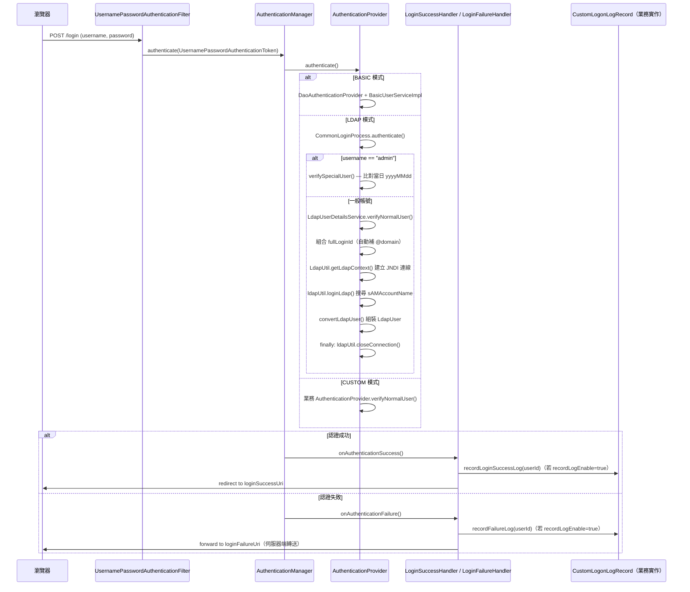

# 架構與開發指南

本文件面向需要維護、擴充或深入理解 `logon-spring-boot-starter` 的開發人員，涵蓋完整的套件結構、核心類別設計、請求協作流程、自動配置原理，以及實作擴充時的步驟與陷阱。

---

## 1. 模組定位與設計理念

### 定位

`logon-spring-boot-starter` 是一個 **Spring Boot Auto-Configuration 模組**，目的是讓業務系統只需引入依賴並撰寫少量 YAML，即可獲得完整的表單登入、LDAP 驗證或自訂驗證能力，無需手動配置 `SecurityFilterChain`。

### 設計理念

| 理念 | 說明 |
|---|---|
| **開箱即用** | 引入依賴後，模組無條件啟動 Spring Security 過濾鏈，預設開啟基本表單登入（BASIC 模式） |
| **策略模式切換驗證** | 透過 `security.verification-type`（`basic` / `ldap` / `custom`）在不修改程式碼的前提下切換驗證機制 |
| **骨架 + 擴充** | `CommonLoginProcess` 提供統一的 `authenticate()` 骨架（含 ADMIN 動態密碼），子類別只需覆寫 `verifyNormalUser()` |
| **回呼介面分離** | 登入稽核邏輯透過 `CustomLogonLogRecord` 介面解耦，業務專案自行實作，不污染 Starter 核心 |
| **Bean 覆寫友善** | `application.yml` 預設啟用 `spring.main.allow-bean-definition-overriding: true`，業務專案可以同名 Bean 覆寫任何預設實作 |

### 限制與取捨

- 模組**無任何 `@ConditionalOnXxx` 條件**：只要引入依賴，`SecurityConfiguration` 無條件生效。業務專案不得另行定義 `SecurityFilterChain` Bean，否則將衝突。
- BASIC 模式的 `BasicUserServiceImpl` 為 **hardcoded stub**（帳號 `admin`，密碼 `admin`），僅適合開發測試，生產環境必須切換至 CUSTOM 模式或覆寫此 Bean。

---

## 2. 套件結構

```
logon-spring-boot-starter/
├── pom.xml
└── src/main/
    ├── java/com/zipe/
    │   ├── Application.java                          # 模組本身的 Spring Boot 啟動入口（僅供模組獨立開發 / 測試用）
    │   ├── autoconfiguration/
    │   │   └── SecurityConfiguration.java            # @AutoConfiguration 唯一入口，配置 SecurityFilterChain、所有 Handler 與 AuthenticationProvider
    │   ├── base/service/
    │   │   └── SecurityBaseService.java              # 業務 Service 繼承的基底類別，封裝從 HttpSession 取出 SysUserVO 的邏輯
    │   ├── config/
    │   │   ├── LdapPropertyConfig.java               # @ConfigurationProperties(prefix="security.ldap")，LDAP 連線屬性
    │   │   ├── SecurityInitializer.java              # 繼承 AbstractSecurityWebApplicationInitializer，傳統 WAR 部署時確保 Security Filter 正確初始化
    │   │   └── SecurityPropertyConfig.java           # @ConfigurationProperties(prefix="security")，所有 Security 主屬性（含巢狀 LdapPropertyConfig）
    │   ├── enums/
    │   │   ├── UserEnum.java                         # 特殊使用者類型（SYSTEM / ADMIN），ADMIN 具動態密碼特權
    │   │   └── VerificationTypeEnum.java             # 驗證模式（BASIC / LDAP / CUSTOM），提供大小寫不敏感的 getEnum() 解析
    │   ├── exception/
    │   │   ├── LdapException.java                    # LDAP 連線失敗時拋出，繼承 AuthenticationException
    │   │   └── UserNotActivatedException.java        # 帳號未啟用時拋出，繼承 AuthenticationException（目前保留備用）
    │   ├── handler/
    │   │   ├── LoginFailureHandler.java              # 登入失敗處理器，分類日誌並回呼 CustomLogonLogRecord
    │   │   ├── LoginSuccessHandler.java              # 登入成功處理器，擷取 IP 並回呼 CustomLogonLogRecord
    │   │   └── LogoutSuccessHandler.java             # 登出成功處理器，清理 Session 並回呼 CustomLogonLogRecord
    │   ├── model/
    │   │   └── LdapUser.java                         # LDAP 驗證後的資料傳輸物件（userId / name / email / ldapDn / isEnabled）
    │   ├── service/
    │   │   ├── BasicUserServiceImpl.java             # 實作 UserDetailsService，BASIC 模式的 hardcoded fallback（admin/admin）
    │   │   ├── CommonLoginProcess.java               # 抽象類別，實作 AuthenticationProvider，統一 authenticate() 並提供 ADMIN 動態密碼機制
    │   │   ├── CustomLogonLogRecord.java             # 登入稽核回呼介面，業務專案實作後由三個 Handler 呼叫
    │   │   └── LdapUserDetailsService.java           # 繼承 CommonLoginProcess，實作 verifyNormalUser()，與 AD/LDAP 互動
    │   ├── util/
    │   │   └── UserInfoUtil.java                     # 靜態工具，從 SecurityContextHolder 取出當前登入者 userId
    │   └── vo/
    │       └── SysUserVO.java                        # 儲存於 HttpSession 的使用者 VO（userId / loginTime），實作 Serializable
    └── resources/
        ├── application.yml                           # 模組內建預設屬性（LDAP 範例值與 security.* 所有屬性預設值）
        └── META-INF/spring/
            └── org.springframework.boot.autoconfigure.AutoConfiguration.imports  # 單行：com.zipe.autoconfiguration.SecurityConfiguration
```

### 套件職責摘要

| 套件 | 職責 |
|---|---|
| `autoconfiguration` | Spring Boot Auto-Configuration 的唯一對外入口 |
| `base/service` | 業務層基底，封裝 Session 存取，子類別呼叫 `fetchLoginUser()` 取得當前 VO |
| `config` | 屬性綁定（`@ConfigurationProperties`）與 WAR 容器初始化支援 |
| `enums` | 驗證模式常數與特殊使用者類型常數，供 `SecurityConfiguration` 與 `CommonLoginProcess` 參照 |
| `exception` | 自訂 `AuthenticationException` 子類別，使 Spring Security 能辨識並路由至正確的失敗處理器 |
| `handler` | 三個登入生命週期 Handler，負責日誌輸出、IP 記錄、Session 清理與稽核回呼 |
| `model` | LDAP 查詢結果的 POJO |
| `service` | 核心驗證邏輯：`AuthenticationProvider` 抽象骨架、LDAP 實作、BASIC fallback、稽核介面 |
| `util` | `SecurityContextHolder` 存取工具 |
| `vo` | Session 中儲存的使用者資料結構 |

---

## 3. 核心類別詳解

### 3.1 SecurityConfiguration（`autoconfiguration` 套件）

**職責：** 模組唯一的 `@AutoConfiguration` 類別，統籌配置 `SecurityFilterChain`、Handler Bean 與 `AuthenticationProvider`。

**關鍵方法：**

| 方法 | 說明 |
|---|---|
| `filterChain(HttpSecurity)` | 依 `security.login-uri` 是否有值，分派至 `customLoginConfigure()` 或 `basicLoginConfigure()` |
| `basicLoginConfigure(HttpSecurity)` | 使用 Spring Security 預設登入頁；Session 策略 Stateful，最多 2 個並行 Session |
| `customLoginConfigure(HttpSecurity)` | 指定自訂 `loginPage(loginUri)`；Session 策略 STATELESS，最多 2 個並行 Session（詳見[維護注意事項](#7-維護注意事項與常見陷阱)） |
| `authenticationProvider(HttpSecurity)` | `switch-case` 依 `VerificationTypeEnum`：`LDAP` 掛載 `LdapUserDetailsService`；`CUSTOM` 從 ApplicationContext 取出指定 Bean；`BASIC`（預設）掛載 `DaoAuthenticationProvider` + `BasicUserServiceImpl` |
| `switchSecurity()` | `security.enable=false` 時回傳 `["/**"]`（全路徑放行）；否則回傳 `allow-uris` 切分後的陣列 |
| `passwordEncoder()` | `@Bean`，回傳 `BCryptPasswordEncoder` |
| `sessionRegistry()` | `@Bean`，回傳 `SessionRegistryImpl`，供並行 Session 控制使用 |

**注冊的 Bean 清單：**

| Bean 名稱 | 型別 | 說明 |
|---|---|---|
| `filterChain` | `SecurityFilterChain` | 主過濾鏈 |
| `passwordEncoder` | `PasswordEncoder` | BCrypt 密碼編碼器 |
| `basicUserServiceImpl` | `BasicUserServiceImpl` | BASIC 模式 UserDetailsService（hardcoded stub） |
| `ldapUserDetailsService` | `LdapUserDetailsService` | LDAP 模式 AuthenticationProvider（無論驗證類型均建立） |
| `sessionRegistry` | `SessionRegistry` | Session 並行控制登錄 |
| `loginSuccessHandler` | `LoginSuccessHandler` | 登入成功處理器 |
| `loginFailureHandler` | `LoginFailureHandler` | 登入失敗處理器 |
| `logoutSuccessHandler` | `LogoutSuccessHandler` | 登出成功處理器 |

---

### 3.2 SecurityPropertyConfig 與 LdapPropertyConfig（`config` 套件）

**SecurityPropertyConfig（prefix: `security`）：**

| 屬性鍵 | 型別 | 預設值 | 說明 |
|---|---|---|---|
| `enable` | Boolean | `true` | 安全控制總開關；`false` 時全路徑放行 |
| `verification-type` | String | `basic` | 驗證模式：`basic` / `ldap` / `custom` |
| `record-log-enable` | Boolean | `false` | 是否回呼 `CustomLogonLogRecord` |
| `custom-record-log-bean` | String | 無 | `record-log-enable=true` 時必填，指定稽核 Bean 名稱 |
| `allow-uris` | String | 無 | 逗號分隔的免驗證路徑，如 `/static/**,/public/**` |
| `login-uri` | String | `/login` | 自訂登入頁路徑；設定此值則採用 `customLoginConfigure` |
| `login-success-uri` | String | `/dashboard` | 登入成功後的導向路徑 |
| `login-failure-uri` | String | `/login` | 登入失敗後的轉送路徑（伺服器端 forward，非 redirect） |
| `custom-bean-name` | String | 無 | `verification-type=custom` 時必填，指定 AuthenticationProvider Bean 名稱 |
| `csrf-enabled` | Boolean | `false` | CSRF 保護開關 |
| `ldap` | LdapPropertyConfig | 巢狀物件 | LDAP 子設定群組 |

**LdapPropertyConfig（prefix: `security.ldap`）：**

| 屬性鍵 | 型別 | 預設值 | 說明 |
|---|---|---|---|
| `ip` | String | 無 | LDAP / AD 伺服器 IP |
| `domain` | String | 無 | 網域名稱，自動補全登入帳號（`userId@domain`） |
| `port` | String | 無 | LDAP 埠號（通常 389 或 636） |
| `dn` | String | `DC=zipe,DC=local` | 搜尋起始 DN |

---

### 3.3 CommonLoginProcess（`service` 套件，抽象類別）

**職責：** `AuthenticationProvider` 的抽象骨架，統一 `authenticate()` 入口，提供 ADMIN 特權帳號機制，子類別只需覆寫 `verifyNormalUser()`。

| 方法 | 說明 |
|---|---|
| `supports(Class<?>)` | 固定回傳 `UsernamePasswordAuthenticationToken.class` |
| `authenticate(Authentication)` | 帳號為空拋 `UsernameNotFoundException`；帳號（不分大小寫）等於 `admin` 呼叫 `verifySpecialUser()`；否則呼叫 `verifyNormalUser()` |
| `verifySpecialUser(userName, password)` | 以**當日日期**（格式 `yyyyMMdd`）作為 ADMIN 動態密碼；不符則拋 `BadCredentialsException` |
| `verifyNormalUser(loginId, password)` | **抽象方法**，子類別實作，需回傳 `UsernamePasswordAuthenticationToken` |

**繼承 `CommonLoginProcess` 即自動獲得 ADMIN 動態密碼機制**，這是設計上鼓勵的擴充方式。

---

### 3.4 LdapUserDetailsService（`service` 套件）

**職責：** 繼承 `CommonLoginProcess`，與 Active Directory / LDAP 互動完成驗證。

**`verifyNormalUser()` 執行流程：**

1. 若帳號不含 `@`，自動拼接 `@domain`（取自 `security.ldap.domain`）
2. 建立 `LdapUtil`（來自 `base-spring-boot-starter`），呼叫 `getLdapContext()` 建立 JNDI 連線
3. 呼叫 `ldapUtil.loginLdap()` 以 `sAMAccountName` 搜尋使用者並取回 `Attributes`
4. 呼叫 `convertLdapUser()` 組裝 `LdapUser` VO
5. 例外映射：`AuthenticationException` → `BadCredentialsException`；`NamingException` → `LdapException`；其他 → `BadCredentialsException`
6. `finally` 必定呼叫 `ldapUtil.closeConnection()` 釋放連線
7. 成功後去除帳號中的網域部分，回傳 `UsernamePasswordAuthenticationToken(userName, password, null)`

---

### 3.5 Handler 類別（`handler` 套件）

**LoginSuccessHandler（繼承 `SavedRequestAwareAuthenticationSuccessHandler`）：**

- `alwaysUseDefaultTargetUrl=false`：優先還原使用者原始請求 URL，其次才導向 `login-success-uri`
- IP 取得優先順序：`X-Forwarded-For` → `Proxy-Client-IP` → `WL-Proxy-Client-IP` → `HTTP_CLIENT_IP` → `HTTP_X_FORWARDED_FOR` → `request.getRemoteAddr()`
- `record-log-enable=true` 時呼叫 `customLogonLogRecord.recordLoginSuccessLog(userId)`

**LoginFailureHandler（繼承 `SimpleUrlAuthenticationFailureHandler`）：**

- `useForward=true`：登入失敗採用**伺服器端 forward**（非 redirect），瀏覽器 URL 不改變
- 依 `AuthenticationException` 子型別輸出對應 warn 日誌：`UsernameNotFoundException` / `DisabledException` / `BadCredentialsException` / `LdapException` / 其他
- `record-log-enable=true` 時呼叫 `customLogonLogRecord.recordFailureLog(loginId)`

**LogoutSuccessHandler（繼承 `SimpleUrlLogoutSuccessHandler`）：**

- `alwaysUseDefaultTargetUrl=true`：登出後固定導向 `login-success-uri`
- 呼叫 `destroyLoginUserInfo(request)` 從 Session 移除以帳號為 key 的屬性
- `record-log-enable=true` 時呼叫 `customLogonLogRecord.recordFailureLog()`（詳見[已知 Bug](#已知-bug)）

---

### 3.6 CustomLogonLogRecord（`service` 套件，介面）

業務專案實作此介面並宣告為 Spring Bean，名稱填入 `security.custom-record-log-bean`。

| 方法 | 觸發時機 |
|---|---|
| `recordLoginSuccessLog(String userId)` | `LoginSuccessHandler.onAuthenticationSuccess()` |
| `recordFailureLog(String userId)` | `LoginFailureHandler.onAuthenticationFailure()`；以及（設計缺陷）`LogoutSuccessHandler.onLogoutSuccess()` |
| `recordLogoutSuccessLog(String userId)` | 介面定義中存在，但**目前 `LogoutSuccessHandler` 並未呼叫此方法**（疑似 bug） |

---

### 3.7 工具類別與 VO

**UserInfoUtil（`util` 套件，靜態工具）：**

| 方法 | 說明 |
|---|---|
| `loginUserId()` | 從 `SecurityContextHolder` 取出 principal；若為 `UserDetails` 物件取 `getUsername()`，否則直接 `toString()` |

未登入時 principal 為字串 `"anonymousUser"`，呼叫端需自行判斷。

**SecurityBaseService（`base/service` 套件）：**

| 方法 | 說明 |
|---|---|
| `fetchLoginUser()` | 呼叫 `UserInfoUtil.loginUserId()`；若為 `"anonymousUser"` 回傳 `null`；否則從 Session 取出並轉型為 `SysUserVO` |

業務 Service 繼承此類別即可直接呼叫 `fetchLoginUser()`，無需重複撰寫 Session 存取邏輯。

**SysUserVO（`vo` 套件）：**

| 欄位 | 型別 | 說明 |
|---|---|---|
| `userId` | String | 登入帳號 |
| `loginTime` | String | 登入時間（字串格式，由業務端填入 Session） |

實作 `Serializable`（`serialVersionUID=1L`），儲存於 `HttpSession`。

**VerificationTypeEnum（`enums` 套件）：**

| 值 | 說明 |
|---|---|
| `BASIC` | 使用 `BasicUserServiceImpl`（DaoAuthenticationProvider + BCrypt，hardcoded stub） |
| `LDAP` | 使用 `LdapUserDetailsService`（JNDI 連線 AD/LDAP） |
| `CUSTOM` | 使用 `security.custom-bean-name` 指定的 `AuthenticationProvider` Bean |

**UserEnum（`enums` 套件）：**

| 值 | name | 說明 |
|---|---|---|
| `SYSTEM` | `system` | 系統帳號 |
| `ADMIN` | `admin` | 管理者帳號，動態密碼為當日 `yyyyMMdd` |

---

## 4. 核心協作流程

### 4.1 一次完整登入請求流程



### 4.2 一次完整登出流程

```
使用者 POST /logout
    │
    ▼
LogoutSuccessHandler.onLogoutSuccess()
    ├── destroyLoginUserInfo(request)
    │     ├── UserInfoUtil.loginUserId()  → 從 SecurityContextHolder 取得 userId
    │     └── session.removeAttribute(userId)  → 清除 Session 中的使用者資料
    ├── recordLogEnable=true ?
    │     └── customLogonLogRecord.recordFailureLog(userId)
    │           ← [設計缺陷：應呼叫 recordLogoutSuccessLog，詳見維護注意事項]
    └── super.onLogoutSuccess() → redirect to loginSuccessUri
```

### 4.3 業務 Service 取得當前使用者

```
業務 Service（繼承 SecurityBaseService）
    └── fetchLoginUser()
          ├── UserInfoUtil.loginUserId()
          │     └── SecurityContextHolder.getContext().getAuthentication().getPrincipal()
          ├── userId == "anonymousUser" → return null
          └── session.getAttribute(userId) as SysUserVO
```

### 4.4 跨類別依賴關係總覽

```
SecurityConfiguration
├── SecurityPropertyConfig（建構子注入）
├── LdapPropertyConfig（透過 SecurityPropertyConfig.ldap）
├── BasicUserServiceImpl ──────────────── PasswordEncoder
├── LdapUserDetailsService
│   ├── extends CommonLoginProcess
│   │         └── LdapUtil（來自 base-starter）
│   └── SecurityPropertyConfig
├── LoginSuccessHandler
│   ├── SecurityPropertyConfig
│   ├── ApplicationContextHelper → CustomLogonLogRecord（業務實作）
│   └── UserInfoUtil → SecurityContextHolder
├── LoginFailureHandler
│   ├── SecurityPropertyConfig
│   └── ApplicationContextHelper → CustomLogonLogRecord
└── LogoutSuccessHandler
    ├── SecurityPropertyConfig
    ├── ApplicationContextHelper → CustomLogonLogRecord
    └── UserInfoUtil → SecurityContextHolder
```

---

## 5. 自動配置運作原理

### 5.1 Auto-Configuration 入口

Spring Boot 3.x 使用 `META-INF/spring/org.springframework.boot.autoconfigure.AutoConfiguration.imports` 作為自動配置的註冊機制（取代舊版 `spring.factories`）。

本模組的註冊檔內容：

```
com.zipe.autoconfiguration.SecurityConfiguration
```

當引用方的 Spring Boot 應用程式啟動時，框架掃描 classpath 上所有 jar 包中的此檔案，找到 `SecurityConfiguration` 並加入候選清單，最終實例化並將其所有 `@Bean` 方法產生的 Bean 納入 ApplicationContext。

### 5.2 條件註解分析

`SecurityConfiguration` **未宣告任何 `@ConditionalOnXxx` 條件**，這代表：

- 只要引入此 Starter，Security 配置**無條件生效**
- 引用方若要停用，唯一途徑是在 `spring.autoconfigure.exclude` 中排除，或設定 `security.enable=false`（全路徑放行，但 Bean 仍建立）
- 引用方**不得自行定義 `SecurityFilterChain` Bean**，否則 Spring Context 啟動失敗（除非另行排除本模組）

### 5.3 屬性綁定機制

```
SecurityConfiguration
    └── @EnableConfigurationProperties(SecurityPropertyConfig.class)
              └── SecurityPropertyConfig
                    ├── @ConfigurationProperties(prefix = "security")
                    └── private LdapPropertyConfig ldap
                              └── @ConfigurationProperties(prefix = "security.ldap")
```

IDE 自動補全由 `spring-boot-configuration-processor`（optional 依賴）在編譯期產生 `META-INF/spring-configuration-metadata.json`，記錄所有 `security.*` 與 `security.ldap.*` 屬性的型別與說明。

### 5.4 Bean 覆寫機制

模組 `application.yml` 啟用：

```yaml
spring:
  main:
    allow-bean-definition-overriding: true
```

此設定允許業務專案以**相同 Bean 名稱**宣告自己的實作，覆蓋模組預設的 Bean（例如覆寫 `basicUserServiceImpl` 提供真實資料庫查詢，或覆寫 `loginSuccessHandler` 改為回傳 JSON）。

---

## 6. 開發擴充指南

### 6.1 範例一：新增一種驗證模式（以 OTP 為例）

**場景：** 現有 BASIC / LDAP / CUSTOM 三種模式不足以應付所有情境，需新增 OTP 簡訊驗證模式進入核心模組。

**步驟 1：擴充 `VerificationTypeEnum`**

```java
// 檔案：enums/VerificationTypeEnum.java
public enum VerificationTypeEnum {
    BASIC, LDAP, CUSTOM, OTP;  // 新增 OTP

    public static VerificationTypeEnum getEnum(String value) {
        for (VerificationTypeEnum e : values()) {
            if (e.name().equalsIgnoreCase(value)) return e;
        }
        return BASIC;
    }
}
```

**步驟 2：建立新的 AuthenticationProvider**

繼承 `CommonLoginProcess` 自動獲得 ADMIN 動態密碼機制，只需覆寫 `verifyNormalUser()`：

```java
// 新檔案：service/OtpUserDetailsService.java
package com.zipe.service;

import com.zipe.exception.UserNotActivatedException;
import org.springframework.security.authentication.BadCredentialsException;
import org.springframework.security.authentication.UsernamePasswordAuthenticationToken;
import org.springframework.security.crypto.password.PasswordEncoder;

public class OtpUserDetailsService extends CommonLoginProcess {

    private final OtpVerificationClient otpClient;  // 業務 OTP 服務

    public OtpUserDetailsService(PasswordEncoder passwordEncoder,
                                 OtpVerificationClient otpClient) {
        super(passwordEncoder);
        this.otpClient = otpClient;
    }

    @Override
    protected UsernamePasswordAuthenticationToken verifyNormalUser(String loginId, String password) {
        boolean valid = otpClient.verify(loginId, password);
        if (!valid) {
            throw new BadCredentialsException("OTP 驗證失敗：" + loginId);
        }
        return new UsernamePasswordAuthenticationToken(loginId, password, null);
    }
}
```

**步驟 3：在 `SecurityConfiguration` 新增 Bean 與 switch-case**

```java
// 檔案：autoconfiguration/SecurityConfiguration.java

// 1. 新增 Bean 方法
@Bean
public OtpUserDetailsService otpUserDetailsService() {
    OtpVerificationClient otpClient = applicationContext.getBean(OtpVerificationClient.class);
    return new OtpUserDetailsService(this.passwordEncoder(), otpClient);
}

// 2. 在 authenticationProvider() 的 switch 新增 case
private void authenticationProvider(HttpSecurity http) throws Exception {
    switch (Objects.requireNonNull(
            VerificationTypeEnum.getEnum(securityPropertyConfig.getVerificationType()))) {
        case LDAP:
            http.authenticationProvider(ldapUserDetailsService());
            break;
        case OTP:
            http.authenticationProvider(otpUserDetailsService());  // 新增
            break;
        case CUSTOM:
            String beanName = securityPropertyConfig.getCustomBeanName();
            if (beanName == null) throw new IllegalArgumentException(
                    "verification-type=otp 時必須設定 custom-bean-name");
            http.authenticationProvider(
                    applicationContext.getBean(beanName, AuthenticationProvider.class));
            break;
        default:  // BASIC
            DaoAuthenticationProvider provider = new DaoAuthenticationProvider();
            provider.setUserDetailsService(basicUserServiceImpl());
            provider.setPasswordEncoder(passwordEncoder());
            http.authenticationProvider(provider);
    }
}
```

**步驟 4：設定 application.yml（使用端）**

```yaml
security:
  verification-type: otp
```

---

### 6.2 範例二：業務端實作 CUSTOM 驗證（資料庫帳號）

這是**最常見的擴充場景**：業務系統有自己的帳號資料表，不使用 hardcoded stub，也不連接 LDAP。

**方法：繼承 `CommonLoginProcess`（推薦，自動獲得 ADMIN 動態密碼）**

```java
// 業務專案：config/DbAuthProvider.java
package com.example.config;

import com.zipe.service.CommonLoginProcess;
import org.springframework.security.authentication.BadCredentialsException;
import org.springframework.security.authentication.UsernamePasswordAuthenticationToken;
import org.springframework.security.core.userdetails.UsernameNotFoundException;
import org.springframework.security.crypto.password.PasswordEncoder;
import org.springframework.stereotype.Component;

@Component("dbAuthProvider")  // Bean 名稱對應 security.custom-bean-name
public class DbAuthProvider extends CommonLoginProcess {

    private final UserRepository userRepository;

    public DbAuthProvider(PasswordEncoder passwordEncoder, UserRepository userRepository) {
        super(passwordEncoder);
        this.userRepository = userRepository;
    }

    @Override
    protected UsernamePasswordAuthenticationToken verifyNormalUser(String loginId, String password) {
        UserEntity user = userRepository.findByUsername(loginId)
            .orElseThrow(() -> new UsernameNotFoundException("找不到使用者：" + loginId));

        if (!passwordEncoder.matches(password, user.getPassword())) {
            throw new BadCredentialsException("帳號或密碼錯誤");
        }

        // 回傳已認證的 Token；authorities 可視需求填入角色清單
        return new UsernamePasswordAuthenticationToken(loginId, password, null);
    }
}
```

**application.yml（業務專案）：**

```yaml
security:
  verification-type: custom
  custom-bean-name: dbAuthProvider
```

---

### 6.3 範例三：實作登入稽核日誌

業務專案只需實作 `CustomLogonLogRecord` 介面，不修改任何 Starter 程式碼：

```java
// 業務專案：service/AuditLogRecord.java
package com.example.service;

import com.zipe.service.CustomLogonLogRecord;
import org.slf4j.Logger;
import org.slf4j.LoggerFactory;
import org.springframework.stereotype.Component;

import java.time.LocalDateTime;

@Component("auditLogRecord")  // Bean 名稱對應 security.custom-record-log-bean
public class AuditLogRecord implements CustomLogonLogRecord {

    private static final Logger log = LoggerFactory.getLogger(AuditLogRecord.class);

    private final AuditLogRepository repository;

    public AuditLogRecord(AuditLogRepository repository) {
        this.repository = repository;
    }

    @Override
    public void recordLoginSuccessLog(String userId) {
        repository.save(new AuditLogEntity(userId, "LOGIN_SUCCESS", LocalDateTime.now()));
        log.info("登入成功：{}", userId);
    }

    @Override
    public void recordFailureLog(String userId) {
        // 注意：此方法同時被「登入失敗」與「登出成功」觸發（LogoutSuccessHandler 的設計缺陷）
        // 建議業務端依 context 自行判斷，或等待 Starter 修復後改呼叫 recordLogoutSuccessLog
        repository.save(new AuditLogEntity(userId, "LOGIN_FAILURE_OR_LOGOUT", LocalDateTime.now()));
        log.warn("登入失敗或登出：{}", userId);
    }

    @Override
    public void recordLogoutSuccessLog(String userId) {
        // 目前 LogoutSuccessHandler 並未呼叫此方法（已知 bug），此處保留供未來修復後使用
        repository.save(new AuditLogEntity(userId, "LOGOUT_SUCCESS", LocalDateTime.now()));
    }
}
```

**application.yml：**

```yaml
security:
  record-log-enable: true
  custom-record-log-bean: auditLogRecord
```

---

### 6.4 範例四：覆寫 LoginSuccessHandler 回傳 JSON（前後端分離）

因 `allow-bean-definition-overriding: true`，業務專案宣告同名 Bean 即可覆寫：

```java
// 業務專案：config/SecurityBeanConfig.java
package com.example.config;

import com.zipe.handler.LoginSuccessHandler;
import jakarta.servlet.http.HttpServletRequest;
import jakarta.servlet.http.HttpServletResponse;
import org.springframework.context.annotation.Bean;
import org.springframework.context.annotation.Configuration;
import org.springframework.security.core.Authentication;
import org.springframework.security.web.authentication.AuthenticationSuccessHandler;

import java.io.IOException;

@Configuration
public class SecurityBeanConfig {

    @Bean
    public LoginSuccessHandler loginSuccessHandler() {
        return new LoginSuccessHandler(null, null) {
            @Override
            public void onAuthenticationSuccess(HttpServletRequest request,
                                                HttpServletResponse response,
                                                Authentication authentication) throws IOException {
                response.setContentType("application/json;charset=UTF-8");
                response.getWriter().write("{\"status\":\"ok\",\"userId\":\""
                    + authentication.getName() + "\"}");
            }
        };
    }
}
```

---

## 7. 維護注意事項與常見陷阱

### 已知 Bug

#### Bug 1：LogoutSuccessHandler 呼叫錯誤的稽核方法

`LogoutSuccessHandler.onLogoutSuccess()` 呼叫的是：

```java
logRecord.recordFailureLog(UserInfoUtil.loginUserId());  // 應為 recordLogoutSuccessLog
```

而非介面中定義的 `recordLogoutSuccessLog()`。業務實作無法透過介面方法區分「登入失敗」與「登出」兩個事件。

**修復建議：** 將 `LogoutSuccessHandler` 中的呼叫改為：

```java
logRecord.recordLogoutSuccessLog(UserInfoUtil.loginUserId());
```

---

#### Bug 2：SecurityBaseService 使用 javax.servlet（Spring Boot 3.x 不相容）

`SecurityBaseService.java` 第 8 行：

```java
import javax.servlet.http.HttpSession;  // 錯誤，Spring Boot 3.x 已遷移至 jakarta.*
```

其他 Handler 類別已正確使用 `jakarta.servlet`，此處不一致導致在 Spring Boot 3.x 環境**無法編譯**。

**修復方式：**

```java
import jakarta.servlet.http.HttpSession;  // 正確
```

---

### 設計注意事項

#### 注意 1：BasicUserServiceImpl 為 Hardcoded Stub，不適用生產環境

BASIC 模式下，`BasicUserServiceImpl` 只允許帳號 `admin`，密碼硬編碼為 `admin`。**生產環境必須**：

- 改用 CUSTOM 模式，提供真實資料庫查詢的 `AuthenticationProvider`，或
- 以同名 Bean `basicUserServiceImpl` 覆寫，提供正確的 `UserDetailsService` 實作

#### 注意 2：customLoginConfigure 的 STATELESS 與 Session 並行控制語義衝突

```java
.sessionManagement((session) -> session
    .sessionCreationPolicy(SessionCreationPolicy.STATELESS)
    .maximumSessions(2)         // STATELESS 下此設定不生效
    .sessionRegistry(sessionRegistry()))
```

`STATELESS` 要求 Spring Security 不建立也不使用 `HttpSession`，但 `maximumSessions(2)` 依賴 `SessionRegistry` 需要 Session 支援，兩者語義衝突。若需並行 Session 控制，應改用 `ALWAYS` 或 `IF_REQUIRED` Session 策略。

#### 注意 3：CUSTOM 模式未設定 customBeanName 會拋出 NullPointerException

`SecurityConfiguration.authenticationProvider()` 在 `verification-type=custom` 但未填 `custom-bean-name` 時拋出：

```java
throw new NullPointerException("Please enter value in custom-bean-name");
```

此例外在 Spring Context 啟動時（`filterChain` Bean 建立階段）觸發，應用無法啟動，**行為可接受但錯誤訊息不夠明確**。建議改為：

```java
throw new IllegalArgumentException(
    "security.custom-bean-name 必須設定，當 verification-type=custom 時此屬性為必填");
```

#### 注意 4：LdapUser.name 欄位從未填入

`convertLdapUser()` 組裝 `LdapUser` 時未填入 `name` 欄位，該欄位永遠為 `null`。LDAP 搜尋結果確實包含 `givenname` 和 `sn` 屬性，但程式碼未讀取。若業務系統需要顯示使用者姓名，需修改 `convertLdapUser()` 補充此邏輯。

#### 注意 5：所有 Bean 無條件建立

無論 `verification-type` 為何，`ldapUserDetailsService` Bean 都會被建立。若未設定 LDAP 相關屬性（`ip` / `port` / `dn` 為空），建立 Bean 時不報錯，但實際驗證請求到來時 `LdapUtil` 建構子會因無法連線而拋出 `CommunicationException`。效能影響極小，但需留意啟動期無 LDAP 設定警告。

### 執行緒安全摘要

| 元件 | 安全性 | 說明 |
|---|---|---|
| `UserInfoUtil.loginUserId()` | 安全 | `SecurityContextHolder` 預設 `ThreadLocal` 策略，每執行緒獨立 |
| `ApplicationContextHelper.applicationContext` | 安全 | 靜態欄位，初始化後唯讀 |
| `LdapUtil` | 安全 | 每次驗證請求建立新實例；`finally` 確保 `closeConnection()` 必定執行 |
| `SessionRegistryImpl` | 安全 | 內部使用 `ConcurrentHashMap` |

### 依賴版本一致性

- 模組依賴 `base-spring-boot-starter:3.5.11.0`（`LdapUtil` 來源），兩者版本需同步更新
- `spring-security-test` 為 test scope，不傳遞至引用方
- `spring-boot-configuration-processor` 為 optional，不傳遞至引用方
