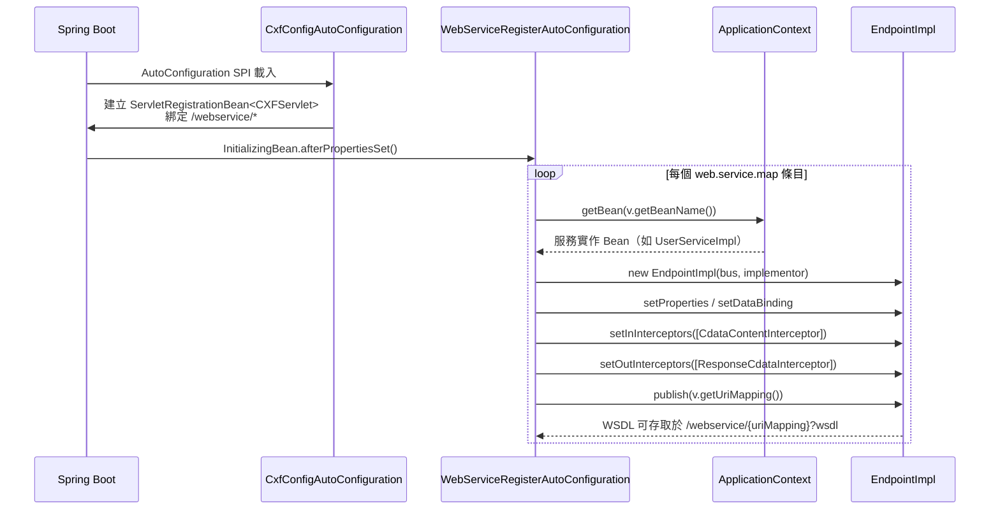

# 架構與開發指南

本文件供需要深入了解 `web-service-spring-boot-starter` 內部機制、二次開發或日後維護的開發人員閱讀。內容涵蓋套件結構、核心類別職責、協作流程、AutoConfiguration 原理、擴充範例，以及維護時需留意的陷阱。

---

## 一、模組定位與設計理念

`web-service-spring-boot-starter` 以 **Apache CXF** 為核心，讓 Spring Boot 應用程式能透過設定檔（`application.yml`）動態發布多個 SOAP 端點，而不需在 Java 程式碼中手動建立 `Endpoint`、配置 Bus，或掛載攔截器。

### 設計目標

| 目標 | 實現方式 |
|---|---|
| **零程式碼啟動** | AutoConfiguration SPI + `InitializingBean` 在容器啟動時自動完成端點發布 |
| **可擴充的端點清單** | `application.yml` 中以 `map` 結構任意新增端點，不需修改 starter 原始碼 |
| **透明的 CDATA 處理** | 服務端 In/Out 攔截器自動處理 HTML 實體轉義，業務程式碼無感知 |
| **彈性的客戶端呼叫** | `WebServiceClientUtil` 以動態 WSDL 解析取代編譯期 stub，降低對外部服務的耦合 |

### 技術選型

- **CXF 4.0.x**：Jakarta EE 命名空間（`jakarta.jws.*`、`jakarta.xml.bind.*`），與 Spring Boot 3.x 配對。
- **JAXB DataBinding**：序列化／反序列化層，可透過 `XmlAdapter` 進行欄位級客製化。
- **Apache HttpClient 4.5.x**：`SoapUtil` 底層 HTTP 傳輸（長期應考慮遷移至 HttpClient 5.x）。

---

## 二、套件結構

```
web-service-spring-boot-starter/
├── pom.xml
├── src/
│   ├── main/
│   │   ├── java/com/zipe/
│   │   │   ├── Application.java                           # 模組內部測試啟動入口，非 starter 核心
│   │   │   ├── adapt/
│   │   │   │   └── CdataAdapter.java                      # JAXB XmlAdapter，欄位級 CDATA marshal/unmarshal
│   │   │   ├── autoconfiguration/
│   │   │   │   ├── CxfConfigAutoConfiguration.java        # AutoConfiguration：CXF Servlet 路徑註冊
│   │   │   │   └── WebServiceRegisterAutoConfiguration.java  # AutoConfiguration：依設定動態發布端點
│   │   │   ├── config/
│   │   │   │   ├── Service.java                           # 單一端點的設定 POJO（beanName + uriMapping）
│   │   │   │   └── WebServicePropertyConfig.java          # @ConfigurationProperties 綁定 web.service.*
│   │   │   ├── interceptor/
│   │   │   │   ├── CdataContentInterceptor.java           # CXF 入站攔截器（Phase.RECEIVE）：解 HTML 實體
│   │   │   │   └── ResponseCdataInterceptor.java          # CXF 出站攔截器（Phase.PRE_STREAM）：解 HTML 實體
│   │   │   ├── model/
│   │   │   │   └── User.java                              # 示範 POJO，示範 @XmlJavaTypeAdapter(CdataAdapter)
│   │   │   ├── service/
│   │   │   │   ├── UserService.java                       # 示範 @WebService 介面
│   │   │   │   └── impl/UserServiceImpl.java              # 示範 @WebService 實作
│   │   │   └── util/
│   │   │       ├── ClientLoginInterceptor.java            # 客戶端 SOAP Header 認證攔截器
│   │   │       ├── SoapUtil.java                          # 原始 HTTP POST + SOAP 訊息解析工具
│   │   │       ├── WebServiceClientUtil.java              # 動態 WSDL 客戶端工具
│   │   │       └── XmlUtil.java                           # Jackson XmlMapper 物件 ↔ XML 工具
│   │   └── resources/
│   │       ├── application.yml                            # 模組內建範例設定
│   │       └── META-INF/spring/
│   │           └── org.springframework.boot.autoconfigure.AutoConfiguration.imports  # SPI 入口
│   └── test/java/com/zipe/
│       └── ClientTest.java                                # 手動測試客戶端（main 方法）
└── target/classes/META-INF/
    └── spring-configuration-metadata.json                 # IDE 設定提示元資料（編譯期自動生成）
```

### 各 package 職責說明

| package | 職責 |
|---|---|
| `com.zipe.autoconfiguration` | Spring Boot AutoConfiguration 入口。`CxfConfigAutoConfiguration` 綁定 CXF Servlet；`WebServiceRegisterAutoConfiguration` 遍歷設定動態發布端點，是整個 starter 的核心啟動邏輯。 |
| `com.zipe.config` | 屬性配置層。`WebServicePropertyConfig` 以 `@ConfigurationProperties(prefix = "web.service")` 綁定全域設定；`Service` 為每個端點的設定 POJO（`beanName` + `uriMapping`）。 |
| `com.zipe.interceptor` | 服務端 CXF 攔截器。`CdataContentInterceptor` 在訊息進入時（`RECEIVE` 階段）將 HTML 實體恢復為 CDATA 或 XML；`ResponseCdataInterceptor` 在送出前（`PRE_STREAM` 階段）做同樣的反轉義。 |
| `com.zipe.adapt` | JAXB 層的 `XmlAdapter`，用於欄位層級的 CDATA 包裹與解開，直接宣告在 JAXB 模型欄位上，不依賴 CXF 攔截器管線。 |
| `com.zipe.util` | 客戶端工具集。`WebServiceClientUtil` 封裝 `JaxWsDynamicClientFactory`；`SoapUtil` 以 Apache HttpClient 直送 SOAP XML；`ClientLoginInterceptor` 在 `PREPARE_SEND` 階段插入 `SecurityHeader`；`XmlUtil` 提供 Jackson XmlMapper 便利方法。 |
| `com.zipe.service` / `com.zipe.service.impl` | **示範用**服務介面與實作，供學習與本地測試。業務專案不需要也不應依賴這兩個 package（詳見「維護注意事項」）。 |
| `com.zipe.model` | **示範用** POJO，說明如何在欄位上宣告 `@XmlJavaTypeAdapter(CdataAdapter.class)`。 |

---

## 三、核心類別詳解

### 3.1 `CxfConfigAutoConfiguration`

**全名：** `com.zipe.autoconfiguration.CxfConfigAutoConfiguration`

**職責：** 向 Servlet 容器（Tomcat / Jetty）注冊 `CXFServlet`，以 `WebServicePropertyConfig.uriMapping`（預設 `/webservice/*`）作為 URL 前綴。所有透過本 starter 發布的 SOAP 端點，URL 均以此前綴起頭。

**條件：** `@ConditionalOnClass(WebServicePropertyConfig.class)`（只要 classpath 有本 starter 即成立）。

| Bean 方法 | 回傳型別 | 說明 |
|---|---|---|
| `cxfServletRegistration()` | `ServletRegistrationBean<CXFServlet>` | 將 CXF 核心 Servlet 綁定至 `web.service.uri-mapping` 所設定的路徑。 |

---

### 3.2 `WebServiceRegisterAutoConfiguration`

**全名：** `com.zipe.autoconfiguration.WebServiceRegisterAutoConfiguration`

**職責：** 在 Spring 容器啟動（`afterPropertiesSet()`）時，遍歷 `WebServicePropertyConfig.map` 中的每一筆設定，從 `ApplicationContext` 取出對應的 Spring Bean，建立 `EndpointImpl`，掛載 CDATA 攔截器，最後呼叫 `endpoint.publish(uriMapping)` 動態發布 SOAP 端點。

**實作介面：** `InitializingBean`、`ApplicationContextAware`

| 方法 | 說明 |
|---|---|
| `afterPropertiesSet()` | 核心邏輯：對 `webServicePropertyConfig.getMap()` 的每個條目，取 Bean → 建 `EndpointImpl` → 設定屬性與 `JAXBDataBinding` → 掛 In/Out 攔截器 → `publish(uriMapping)`。 |
| `setApplicationContext(ApplicationContext ctx)` | 儲存 `ApplicationContext`，供 `afterPropertiesSet()` 依 `beanName` 查找服務實作 Bean。 |

**EndpointImpl 關鍵配置：**

| 設定項目 | 值 | 說明 |
|---|---|---|
| `set-jaxb-validation-event-handler` | `"false"` | 忽略空命名空間的驗證事件，避免不必要的解析例外。 |
| `JAXBDataBinding.setUnwrapJAXBElement` | `true` | 自動解開 `JAXBElement` 包裝，讓方法簽章更簡潔。 |
| `JAXBDataBinding.setMtomEnabled` | `true` | 啟用 MTOM（訊息傳輸優化機制），支援二進位附件。 |
| In interceptor | `CdataContentInterceptor` | 處理進入訊息的 HTML 實體轉義（`Phase.RECEIVE`）。 |
| Out interceptor | `ResponseCdataInterceptor` | 處理回應的 HTML 實體轉義（`Phase.PRE_STREAM`）。 |

:::warning 攔截器硬編碼
兩個 CDATA 攔截器對所有端點無條件掛載，目前無法透過設定針對個別端點開關。若端點欄位不含特殊字元，攔截器仍會執行（效能影響輕微，但架構上缺乏彈性）。
:::

---

### 3.3 `WebServicePropertyConfig`

**全名：** `com.zipe.config.WebServicePropertyConfig`

**職責：** 綁定 `application.yml` 的 `web.service.*` 前綴，作為整個 starter 的設定入口。

| 欄位 | 型別 | 預設值 | 說明 |
|---|---|---|---|
| `uriMapping` | `String` | `/webservice/*` | CXF Servlet 的 URL 前綴（含萬用字元），所有端點都掛在此前綴下。 |
| `map` | `Map<String, Service>` | 無 | key 為邏輯名稱（任意），value 為 `Service` POJO（`beanName` + `uriMapping`）。 |

---

### 3.4 `Service`（Config POJO）

**全名：** `com.zipe.config.Service`

**職責：** 代表一個 SOAP 端點的設定資料，由 `WebServicePropertyConfig.map` 的 value 反序列化而來。

| 欄位 | 說明 |
|---|---|
| `beanName` | 實作服務的 Spring Bean 名稱，用於 `ApplicationContext.getBean(beanName)` 取出 implementor。 |
| `uriMapping` | 此端點在 CXF Servlet 下的相對路徑，最終 WSDL URL 為 `{CXF前綴}{uriMapping}?wsdl`。 |

---

### 3.5 `CdataContentInterceptor`

**全名：** `com.zipe.interceptor.CdataContentInterceptor`

**父類別：** `AbstractPhaseInterceptor<Message>`（`Phase.RECEIVE`）

**職責：** 攔截進入伺服器的原始 SOAP 訊息位元組串流。SOAP 客戶端傳送 CDATA 區段時，框架常將 `<![CDATA[` 轉義為 HTML 實體，導致 JAXB 無法正確反序列化。此攔截器在 JAXB 解析前將實體恢復。

**轉換規則：**

| 來源（轉義後） | 目標（恢復） |
|---|---|
| `&lt;![CDATA[` | `<![CDATA[` |
| `]]&gt;` | `]]>` |
| `&lt;email&gt;` | `<email>` |
| `&lt;/email&gt;` | `</email>` |
| `&lt;` | `<` |
| `&gt;` | `>` |

**實作要點：** 以 `CachedOutputStream` 緩衝整個 `InputStream`，避免直接在流上修改；處理完成後以 `ByteArrayInputStream` 取代原始 `InputStream` 放回 `Message`。

---

### 3.6 `ResponseCdataInterceptor`

**全名：** `com.zipe.interceptor.ResponseCdataInterceptor`

**父類別：** `AbstractSoapInterceptor`（`Phase.PRE_STREAM`）

**職責：** 攔截伺服器回應的輸出串流。JAXB 序列化後若欄位使用了 `CdataAdapter.marshal()`，CXF / JAXB 可能再次對尖括號做 HTML 轉義。此攔截器在最後輸出前把轉義還原，確保客戶端收到真正的 CDATA 區段。

**轉換規則：** 與 `CdataContentInterceptor` 相同，額外多一條 `&amp;` → `&`。

**實作要點：** 以 `CachedOutputStream` 替換輸出的 `OutputStream`，待 interceptor chain 其餘環節寫完後，讀取緩衝內容處理，再以 `IOUtils.copy()` 寫回原始 `OutputStream`。**整個回應訊息會全部緩衝在記憶體中**，若回應極大需注意記憶體用量（詳見「維護注意事項」）。

---

### 3.7 `CdataAdapter`

**全名：** `com.zipe.adapt.CdataAdapter`

**父類別：** `XmlAdapter<String, String>`

**職責：** 用於 JAXB 欄位層級的 CDATA 處理，以 `@XmlJavaTypeAdapter(CdataAdapter.class)` 標注在模型 getter 上。

| 方法 | 說明 |
|---|---|
| `marshal(String v)` | 序列化時：若字串含 `<` 或 `>`，包裹為 `<![CDATA[...]]>`；否則原樣傳回。 |
| `unmarshal(String v)` | 反序列化時：若含 `"CDATA"` 字樣，移除 CDATA 包裹與 HTML 實體；否則原樣傳回。 |

---

### 3.8 `ClientLoginInterceptor`

**全名：** `com.zipe.util.ClientLoginInterceptor`

**父類別：** `AbstractPhaseInterceptor<SoapMessage>`（`Phase.PREPARE_SEND`）

**職責：** 客戶端側的 SOAP Header 認證。在送出請求前，建立 `SecurityHeader` SOAP Header 元素（含 `<authrity><userName>...</userName><userPassword>...</userPassword></authrity>`），插入 Header 清單第 0 個位置。

**建構子：** `ClientLoginInterceptor(String userName, String userPassword)`

:::warning 已知拼字錯誤
`auth` 子元素名稱為 `authrity`（非 `authority`）。若對接的外部系統以 XPath 解析 SOAP Header，需注意此拼字是否符合對方的預期格式。
:::

---

### 3.9 `WebServiceClientUtil`

**全名：** `com.zipe.util.WebServiceClientUtil`

**職責：** 封裝 CXF `JaxWsDynamicClientFactory`，以物件形式（`wsdlUrl` + `methodName` + `params`）呼叫遠端 SOAP 服務，**不需要在編譯期匯入對方的 stub 類別**。

| 欄位 | 說明 |
|---|---|
| `wsdlUrl` | 遠端 WSDL 地址（含 `?wsdl`）。 |
| `methodName` | 要呼叫的操作名稱（大小寫需與 WSDL 一致）。 |
| `params` | 方法參數陣列（可為 `null`，內部會轉為空陣列）。 |

| 方法 | 說明 |
|---|---|
| `invoke()` | 無認證呼叫，委派給 `invoke(null, null)`。 |
| `invoke(String username, String password)` | 建立動態 Client；若需要認證則加 `ClientLoginInterceptor`；呼叫 `client.invoke(methodName, params)`。失敗時記錄 ERROR 後重新拋出。 |

:::danger 已知 Bug：認證條件邏輯反向
`invoke(String username, String password)` 中判斷條件為 `if (StringUtils.isBlank(username))`（條件**反向**）：
- 傳入 `null` / 空字串時反而加攔截器（username 是空的，攔截器無效）。
- 傳入真實帳密時反而**不加**攔截器（認證完全無效）。

正確應為 `if (StringUtils.isNotBlank(username))`。在 bug 修復前，若需要認證請直接手動將 `ClientLoginInterceptor` 加入 `client.getOutInterceptors()`，而不要依賴此方法的 username/password 參數。
:::

---

### 3.10 `SoapUtil`

**全名：** `com.zipe.util.SoapUtil`

**職責：** 提供 Apache HttpClient 底層 SOAP 呼叫工具，以及從 SOAP 回應 XML 中抽取特定標籤內容的便利方法。適用於無法取得 WSDL、或需要直接組裝 SOAP Envelope 的場景。

| 方法 | 說明 |
|---|---|
| `doPostWithXml(String url, String xml)` | 以 `CloseableHttpClient` 做 HTTP POST，`Content-Type: application/xml`，回傳 UTF-8 字串。 |
| `getResponseXml(String soapXml, String tagName)` | 以**停用 DTD/外部實體**的 `DocumentBuilderFactory` 解析 SOAP 回應，取 `getElementsByTagName(tagName)` 節點，再以安全的 `TransformerFactory` 序列化為 XML 字串。例外以 `RuntimeException` 包裹。 |
| `getFromSoapXml(String soapXml, String tagName)` | 功能與 `getResponseXml` 相同。**簽章已變更**為 `throws IOException, TransformerException, ParserConfigurationException, SAXException`（移除 `SOAPException`）。兩方法共用內部的安全解析輔助方法。 |

:::warning XXE 防護與簽章變更
為防止 XXE，SOAP 解析已改用設定 `disallow-doctype-decl=true`、停用內外部實體與外部 DTD 的 `DocumentBuilderFactory`，並以 `FEATURE_SECURE_PROCESSING`、`ACCESS_EXTERNAL_DTD=""`、`ACCESS_EXTERNAL_STYLESHEET=""` 的 `TransformerFactory` 序列化。任何含 `DOCTYPE` 的輸入會被拒絕（拋出根因含 `DOCTYPE` 的 `SAXParseException`）。

`getFromSoapXml` 的 checked 例外清單已變更：移除 `SOAPException`、新增 `ParserConfigurationException` 與 `SAXException`。原本針對性 `catch (SOAPException)` 的呼叫端需改為 `catch (Exception)` 或補上新例外的處理。
:::

---

### 3.11 `XmlUtil`

**全名：** `com.zipe.util.XmlUtil`

**職責：** 以 Jackson `XmlMapper` 提供 Java 物件 ↔ XML 字串的序列化便利方法，為靜態 Singleton 模式。`XmlMapper` 以**停用 DTD（`SUPPORT_DTD=false`）與外部實體（`IS_SUPPORTING_EXTERNAL_ENTITIES=false`）**的 `XMLInputFactory` 建構，以防護 XXE。

| 設定項目 | 說明 |
|---|---|
| `SerializationInclusion.ALWAYS` | 包含 `null` 欄位 |
| `FAIL_ON_EMPTY_BEANS = false` | 空 Bean 不拋例外 |
| `FAIL_ON_UNKNOWN_PROPERTIES = false` | 反序列化忽略未知欄位 |
| 日期格式 | `yyyy-MM-dd'T'HH:mm:ss.SSS` |
| 模組 | `JavaTimeModule`（Java 8 時間型別支援）|

| 方法 | 說明 |
|---|---|
| `xmlToBean(String xml, Class<T> clazz)` | XML 字串反序列化為 Java 物件，失敗時拋 `RuntimeException`。 |
| `beanToXml(Object obj)` | Java 物件序列化為 XML 字串，失敗時拋 `RuntimeException`。 |

---

## 四、核心協作流程

### 4.1 服務端啟動流程



### 4.2 SOAP 請求進入伺服器的處理流程

文字步驟說明：

1. 客戶端送出 `HTTP POST /webservice/user`。
2. `CXFServlet`（已由 `ServletRegistrationBean` 綁定）接收請求，交給 CXF Bus 路由至對應 `EndpointImpl`。
3. CXF Interceptor Chain 進入 **`Phase.RECEIVE`**：
   - `CdataContentInterceptor.handleMessage()` 讀取 `InputStream`（`CachedOutputStream` 緩衝），呼叫 `processCdataContent()` 還原 HTML 實體（`&lt;![CDATA[` → `<![CDATA[` 等），以 `ByteArrayInputStream` 取代原始串流。
4. JAXB Unmarshaling：`JAXBDataBinding` 將 XML 反序列化為 Java 物件。若模型欄位有 `@XmlJavaTypeAdapter(CdataAdapter.class)`，`CdataAdapter.unmarshal()` 再次清理 CDATA 包裹。
5. 服務實作 Bean 方法執行（如 `UserServiceImpl.getUser(...)`）。

### 4.3 SOAP 回應送出的處理流程

1. 服務方法回傳物件。
2. JAXB Marshaling：`JAXBDataBinding` 將物件序列化為 XML。若欄位有 `CdataAdapter.marshal()`，含 `<` 或 `>` 的字串會被包裹為 `<![CDATA[...]]>`，但 JAXB 可能再次對尖括號做 HTML 轉義。
3. CXF Interceptor Chain 進入 **`Phase.PRE_STREAM`**：
   - `ResponseCdataInterceptor.handleMessage()` 替換 `OutputStream` 為 `CachedOutputStream`，等待後續 chain 寫完序列化結果，讀取緩衝內容並呼叫 `processCdataContent()` 還原轉義，最後以 `IOUtils.copy()` 寫回原始 `OutputStream`。
4. HTTP 回應送出給客戶端，客戶端收到包含真正 CDATA 區段的 XML。

### 4.4 客戶端呼叫遠端 SOAP 服務的流程

1. 業務程式碼建立 `WebServiceClientUtil(wsdlUrl, methodName, params)` 並呼叫 `invoke(username, password)`。
2. `JaxWsDynamicClientFactory.newInstance().createClient(wsdlUrl)` 動態下載並解析 WSDL，生成 CXF `Client`（不需編譯期 stub）。
3. 若 username 非空白（**注意：目前 isBlank 邏輯反向，見「已知 Bug」**），加入 `ClientLoginInterceptor`。
4. 呼叫 `client.invoke(methodName, params)`，觸發 **`Phase.PREPARE_SEND`**：
   - `ClientLoginInterceptor.handleMessage()` 建立 `SecurityHeader`（含 `<authrity>` 子元素），插入 SOAP Header 第 0 位。
5. HTTP POST 送達遠端端點，收到 JAXB 反序列化後的 `Object[]`。

### 4.5 底層 HTTP SOAP 呼叫流程（無 WSDL 動態解析）

```
業務程式碼
  ↓
SoapUtil.doPostWithXml(url, rawSoapXml)
  → Apache HttpClient POST（application/xml）
  → 回傳原始 XML 字串
  ↓（選用）
SoapUtil.getResponseXml(xmlStr, tagName)
  → SAAJ MessageFactory.createMessage()
  → SOAPBody.getElementsByTagName(tagName)
  → Transformer → String
  ↓
業務程式碼處理結果字串（或透過 XmlUtil.xmlToBean() 轉為物件）
```

---

## 五、自動配置運作原理

### 5.1 SPI 登記檔

**路徑：** `src/main/resources/META-INF/spring/org.springframework.boot.autoconfigure.AutoConfiguration.imports`

```
com.zipe.autoconfiguration.CxfConfigAutoConfiguration
com.zipe.autoconfiguration.WebServiceRegisterAutoConfiguration
```

Spring Boot 3.x 在應用程式啟動時掃描此檔，將兩個類別加入自動配置流程。**業務專案不需要任何 `@Import` 或 `@ComponentScan`**，只需引入 Maven 依賴即可啟用。

---

### 5.2 條件註解與 Bean 註冊

**`CxfConfigAutoConfiguration`**

```java
@AutoConfiguration
@ConditionalOnClass(WebServicePropertyConfig.class)   // classpath 有本 starter 即成立
@EnableConfigurationProperties(WebServicePropertyConfig.class)
public class CxfConfigAutoConfiguration {

    @Bean
    public ServletRegistrationBean<CXFServlet> cxfServletRegistration(
            WebServicePropertyConfig config) {
        ServletRegistrationBean<CXFServlet> bean =
            new ServletRegistrationBean<>(new CXFServlet(), config.getUriMapping());
        return bean;
    }
}
```

**`WebServiceRegisterAutoConfiguration`**

```java
@AutoConfiguration
@ConditionalOnClass(WebServicePropertyConfig.class)
@EnableConfigurationProperties(WebServicePropertyConfig.class)
public class WebServiceRegisterAutoConfiguration
        implements InitializingBean, ApplicationContextAware {

    // 不宣告 @Bean；改以 afterPropertiesSet() 程式動態呼叫 EndpointImpl.publish()
    @Override
    public void afterPropertiesSet() {
        webServicePropertyConfig.getMap().forEach((key, service) -> {
            Object implementor = applicationContext.getBean(service.getBeanName());
            EndpointImpl endpoint = new EndpointImpl(bus, implementor);
            // 設定屬性、DataBinding、攔截器...
            endpoint.publish(service.getUriMapping());
        });
    }
}
```

---

### 5.3 屬性綁定（`@ConfigurationProperties`）

**前綴：** `web.service`

```yaml
web:
  service:
    uri-mapping: /webservice/*       # CXF Servlet URL 前綴（含 *），預設值
    map:
      <邏輯名稱>:                     # 任意 key，僅作說明用
        beanName: <Spring Bean 名稱>  # 必填，實作服務的 Bean
        uri-mapping: <相對路徑>       # 必填，端點的相對 URL（如 /user）
```

`WebServicePropertyConfig` 以 `@Configuration` + `@ConfigurationProperties` 雙重標注，**本身就是 Spring Bean**，由 `@EnableConfigurationProperties` 強制啟用，防止業務方未加 `@EnableConfigurationProperties` 時遺漏。

---

### 5.4 IDE 設定提示（`spring-configuration-metadata.json`）

由 `spring-boot-configuration-processor` 在編譯期自動生成，讓 IntelliJ IDEA / VS Code 可在 `application.yml` 中提供自動補全。

| 屬性 | 型別 | 預設值 |
|---|---|---|
| `web.service.uri-mapping` | `String` | `/webservice/*` |
| `web.service.map` | `Map<String, Service>` | — |
| `web.service.map.bean-name` | `String` | — |
| `web.service.map.uri-mapping` | `String` | — |

---

## 六、開發擴充指南

### 情境 A：新增一個新的 SOAP 服務端點（最常見情境）

這是最常見的使用情境，**完全不需要修改 starter 原始碼**，只需在業務專案中完成以下三步驟。

**Step 1：定義服務介面**

```java
// 例：com.example.service.OrderService
import jakarta.jws.WebMethod;
import jakarta.jws.WebParam;
import jakarta.jws.WebResult;
import jakarta.jws.WebService;

@WebService(targetNamespace = "http://service.example.com")
public interface OrderService {

    @WebMethod(action = "createOrder")
    @WebResult(name = "orderId")
    String createOrder(@WebParam(name = "amount") double amount);
}
```

**Step 2：實作服務介面（Spring Bean）**

```java
// 例：com.example.service.impl.OrderServiceImpl
import jakarta.jws.WebService;
import org.springframework.stereotype.Component;

@WebService(
    serviceName = "OrderService",
    targetNamespace = "http://service.example.com",
    endpointInterface = "com.example.service.OrderService"
)
@Component("orderServiceImpl")          // beanName 需與 yml 設定一致
public class OrderServiceImpl implements OrderService {

    @Override
    public String createOrder(double amount) {
        return "ORDER-" + System.currentTimeMillis();
    }
}
```

**Step 3：設定 `application.yml`**

```yaml
web:
  service:
    uri-mapping: /webservice/*          # 若已有可不動
    map:
      order:                            # 邏輯名稱（任意命名，僅供識別）
        beanName: orderServiceImpl      # 與 @Component value 一致
        uri-mapping: /order             # 端點相對路徑
```

重啟應用程式後，WSDL 可從以下 URL 取得：

```
http://localhost:8080/webservice/order?wsdl
```

---

### 情境 B：在模型欄位上啟用 CDATA 處理

當某個服務的回應欄位可能包含 HTML 或 XML 特殊字元（如 `<`、`&`）時，使用 `CdataAdapter` 確保序列化時正確包裹。

```java
import com.zipe.adapt.CdataAdapter;
import jakarta.xml.bind.annotation.XmlElement;
import jakarta.xml.bind.annotation.XmlRootElement;
import jakarta.xml.bind.annotation.adapters.XmlJavaTypeAdapter;

@XmlRootElement
public class Product {
    private String description;

    @XmlElement
    @XmlJavaTypeAdapter(CdataAdapter.class)   // 欄位含特殊字元時加此標注
    public String getDescription() {
        return description;
    }

    public void setDescription(String description) {
        this.description = description;
    }
}
```

搭配 `ResponseCdataInterceptor`（已自動掛載），客戶端收到的 XML 中 `description` 欄位將被包裹為 `<![CDATA[...]]>`。

---

### 情境 C：新增自訂全域 CXF 攔截器

若需要在所有端點加入日誌或稽核攔截器：

**Step 1：建立攔截器類別**

```java
import com.zipe.interceptor.CdataContentInterceptor;
import org.apache.cxf.message.Message;
import org.apache.cxf.phase.AbstractPhaseInterceptor;
import org.apache.cxf.phase.Phase;

public class AuditInInterceptor extends AbstractPhaseInterceptor<Message> {

    public AuditInInterceptor() {
        super(Phase.RECEIVE);
        // 確保在 CdataContentInterceptor 之後執行
        addAfter(CdataContentInterceptor.class.getName());
    }

    @Override
    public void handleMessage(Message message) {
        // 自訂稽核邏輯，例如記錄 IP、操作時間等
    }
}
```

**Step 2：修改 `WebServiceRegisterAutoConfiguration.afterPropertiesSet()`**

```java
endpoint.setInInterceptors(Arrays.asList(
    new CdataContentInterceptor(),
    new AuditInInterceptor()          // 加在這裡
));
```

---

### 情境 D：對接外部 SOAP 服務（客戶端呼叫三種方式）

```java
// 方式一：動態客戶端（推薦，不需要編譯期 stub）
WebServiceClientUtil client = new WebServiceClientUtil(
    "http://external-host/soap/service?wsdl",   // 遠端 WSDL
    "getOrder",                                  // 操作名稱
    new Object[]{"ORDER-001"}                    // 方法參數
);
// ⚠️ 注意：目前 isBlank bug 導致有 username 時攔截器不加入
// 暫時解法：用無參數 invoke()，並手動操作 CXF Client
Object[] result = client.invoke();

// 方式二：底層 HTTP POST（自行組 SOAP Envelope，適用無法取得 WSDL 的場景）
String soapEnvelope = """
    <?xml version='1.0' encoding='UTF-8'?>
    <soapenv:Envelope xmlns:soapenv="http://schemas.xmlsoap.org/soap/envelope/"
                      xmlns:ord="http://service.example.com">
        <soapenv:Header/>
        <soapenv:Body>
            <ord:getOrder><orderId>ORDER-001</orderId></ord:getOrder>
        </soapenv:Body>
    </soapenv:Envelope>
    """;
String response = SoapUtil.doPostWithXml("http://external-host/soap", soapEnvelope);
String extracted = SoapUtil.getResponseXml(response, "orderResult");

// 方式三：將 XML 回應轉為 Java 物件
OrderResult order = XmlUtil.xmlToBean(extracted, OrderResult.class);
```

---

### 情境 E：替換為標準 WS-Security UsernameToken 認證

目前 `ClientLoginInterceptor` 使用非標準的自訂 `SecurityHeader` 格式。若對接的系統要求標準 WS-Security UsernameToken，可替換為 WSS4J：

```java
import org.apache.cxf.ws.security.wss4j.WSS4JOutInterceptor;
import org.apache.wss4j.dom.handler.WSHandlerConstants;
import org.apache.wss4j.dom.WSConstants;

public class Wss4jInterceptorFactory {

    public static WSS4JOutInterceptor create(String username, String password) {
        Map<String, Object> props = new HashMap<>();
        props.put(WSHandlerConstants.ACTION, WSHandlerConstants.USERNAME_TOKEN);
        props.put(WSHandlerConstants.USER, username);
        props.put(WSHandlerConstants.PASSWORD_TYPE, WSConstants.PW_TEXT);
        props.put(WSHandlerConstants.PW_CALLBACK_REF,
            (CallbackHandler) callbacks -> {
                for (Callback cb : callbacks) {
                    if (cb instanceof WSPasswordCallback wpc) {
                        wpc.setPassword(password);
                    }
                }
            }
        );
        return new WSS4JOutInterceptor(props);
    }
}
```

在 `WebServiceClientUtil.invoke()` 中，以此攔截器取代 `ClientLoginInterceptor` 加入 `client.getOutInterceptors()`。

---

## 七、維護注意事項與常見陷阱

### 7.1 已知 Bug 清單

| Bug | 位置 | 說明 |
|---|---|---|
| 認證條件邏輯反向 | `WebServiceClientUtil.invoke(String, String)` | `isBlank` 應改為 `isNotBlank`。見第 3.9 節。 |
| SOAP Header 元素拼字錯誤 | `ClientLoginInterceptor` | `authrity` 非 `authority`。對接依 XPath 解析 Header 的系統時需確認。 |

---

### 7.2 `ResponseCdataInterceptor` 記憶體用量

`ResponseCdataInterceptor` 在 `PRE_STREAM` 階段將整個 SOAP 回應緩衝至記憶體中的 `CachedOutputStream`。若服務回應含大量資料（大型陣列、MTOM 附件），可能造成 GC 壓力或 OOM。

**因應措施：**
- 調整 CXF `CachedOutputStream` 的 threshold，使超過閾值後 spill 至磁碟。
- 若客戶端與服務端均在自己控制下，改從模型層以 `CdataAdapter` 處理，不需掛載出站攔截器。

---

### 7.3 兩層 CDATA 處理的設計理解

本模組同時存在三個 CDATA 處理機制，各司其職：

| 層次 | 類別 | 時機 |
|---|---|---|
| 訊息流層（入） | `CdataContentInterceptor` | JAXB 解析之前，對原始位元組串流操作 |
| JAXB 欄位層 | `CdataAdapter` | JAXB marshal/unmarshal 期間，針對單一欄位 |
| 訊息流層（出） | `ResponseCdataInterceptor` | JAXB 序列化之後，對輸出位元組串流操作 |

此設計應對「SOAP 框架對 CDATA 做二次轉義」的問題，但理解難度較高。`processCdataContent()` 邏輯在兩個攔截器中幾乎重複（出站版多一條 `&amp;` → `&`），建議日後重構時抽取為共用靜態工具方法。

---

### 7.4 示範程式碼混入 starter jar 的問題

`com.zipe.service`、`com.zipe.service.impl`、`com.zipe.model`、`Application.java` 這幾個類別是示範用程式碼，**會被打包進 starter jar 並隨之發布**。

若業務專案開啟 `@SpringBootApplication` 的 component scan，`UserServiceImpl`（帶有 `@Component`）會被自動掃描到並初始化，`WebServiceRegisterAutoConfiguration` 也會嘗試以 `application.yml` 中設定的 `userServiceImpl` bean 發布端點，可能造成非預期行為。

**建議：** 日後將示範程式碼移至獨立的 `example` 模組，或以 `@ConditionalOnProperty` 保護，避免干擾業務專案。

---

### 7.5 `SoapUtil.doPostWithXml` 資源洩漏風險

目前使用傳統 try/catch/finally 模式，若 `response.close()` 在 finally 中拋出 `IOException`，會掩蓋原始業務例外。建議改為 try-with-resources：

```java
try (CloseableHttpClient httpClient = HttpClients.createDefault();
     CloseableHttpResponse response = httpClient.execute(httpPost)) {
    return EntityUtils.toString(response.getEntity(), "UTF-8");
}
```

---

### 7.6 `getResponseXml` 與 `getFromSoapXml` 的差異

兩個方法的差別僅在例外處理方式（一個用 `RuntimeException` 包裹，一個宣告 checked exceptions）。XXE 防護重構後，兩者已抽取共用的安全解析輔助方法（建立停用 DTD/外部實體的 `DocumentBuilderFactory`、安全的 `TransformerFactory` 與標籤序列化），核心邏輯集中於同一處，修改時不再需要同步兩份程式碼。

---

### 7.7 版本相容性注意事項

| 項目 | 說明 |
|---|---|
| **Jakarta EE 命名空間** | 本模組使用 `jakarta.xml.bind`、`jakarta.jws` 等命名空間，**不相容 Spring Boot 2.x**（`javax` 命名空間）。 |
| **CXF 版本** | 確保業務專案的 CXF 版本為 4.0.x（已切換至 Jakarta EE），與本 starter 一致。 |
| **Apache HttpClient** | 目前使用 HttpClient 4.5.x（舊版，已進入維護模式），長期應考慮遷移至 5.x。 |

---

### 7.8 `XmlUtil` 靜態 `XmlMapper` 的執行緒安全

Jackson `XmlMapper` 配置完成後是執行緒安全的，靜態單例設計合適。但 `setDateFormat()` 傳入的 `SimpleDateFormat` 本身不是執行緒安全的；Jackson 在每次序列化時會 clone `SimpleDateFormat`，因此實際上無問題。若未來有人直接取出 `XmlMapper` 實例呼叫 `getDateFormat()`，需留意並發問題。
