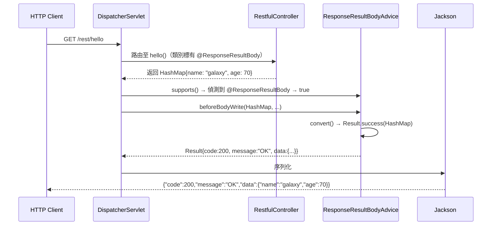

# 架構與開發指南

本文件面向接手維護或二次開發 `web-spring-boot-starter` 的開發人員，說明模組的設計理念、套件結構、核心類別職責、類別協作流程、自動配置運作方式，以及擴充與維護的注意事項。

---

## 1. 模組定位與設計理念

`web-spring-boot-starter` 定位為「前端顯示層基礎設施」，提供以下三個核心能力：

1. **視圖引擎整合**：透過條件式 AutoConfiguration，按應用設定選擇 JSP 或 Thymeleaf（或兩者共存），開發者無須手動配置 ViewResolver。
2. **統一 REST 回應格式**：以 `@ResponseResultBody` 注解 + `ResponseResultBodyAdvice` 的組合，讓所有 REST 端點自動產出結構一致的 `Result<T>` JSON，降低前端解析負擔。
3. **嵌入式 Tomcat 調優**：在 Spring Boot 預設工廠之前注冊客製化 `TomcatServletWebServerFactory`，關閉 JAR manifest 掃描，加速啟動並消除啟動警告。

**設計原則：**

- **零侵入（Zero-Intrusion）**：業務程式碼只需加一個注解（`@ResponseResultBody`）或繼承一個基礎類別（`BaseController`），不需感知 Starter 內部實作。
- **條件式啟用（Conditional Activation）**：所有視圖 Bean 皆以 `@ConditionalOnProperty` 保護，未設定的功能不會注冊任何 Bean。
- **可擴充狀態碼（Extensible Status Codes）**：透過 `IResultStatus` 介面，業務系統可自行定義錯誤碼枚舉，不受 Starter 內建三個狀態的限制。

---

## 2. 套件結構

```
web-spring-boot-starter/
├── pom.xml                                          # 模組建構定義（Spring Boot 3.5.7，Java 17）
└── src/main/
    ├── java/com/zipe/
    │   ├── Application.java                         # 內建獨立執行入口（開發/測試用）
    │   ├── advice/
    │   │   └── ResponseResultBodyAdvice.java        # @RestControllerAdvice：統一回應包裝 + 全域例外處理
    │   ├── annotation/
    │   │   └── ResponseResultBody.java              # 複合注解，標記 Controller 或方法啟用統一回應格式
    │   ├── autoconfiguration/
    │   │   ├── TomcatAutoConfiguration.java         # 客製化 TomcatServletWebServerFactory，關閉 JAR manifest 掃描
    │   │   ├── ViewResolverAutoConfiguration.java   # 條件式 JSP / Thymeleaf ViewResolver 及 LocaleResolver 注冊
    │   │   └── WebAutoConfiguration.java            # 靜態資源 Handler、LocaleChangeInterceptor、DateFormatter
    │   ├── base/controller/
    │   │   └── BaseController.java                  # 抽象基礎 Controller，提供 i18n / Environment 工具方法
    │   ├── config/
    │   │   ├── JspConfig.java                       # 前綴 web.jsp：enable / viewNames / stuff
    │   │   ├── ThymeleafConfig.java                 # 前綴 web.thymeleaf：enable / viewNames / stuff / templateMode
    │   │   ├── WebPropertyConfig.java               # 前綴 web：聚合 resource / jsp / thymeleaf 三個子組
    │   │   └── WebResourceConfig.java               # 前綴 web.resource：pathPattern / location
    │   ├── controller/
    │   │   ├── RestfulController.java               # REST 示範，驗證 @ResponseResultBody 各種回傳型別
    │   │   └── WebController.java                   # 視圖示範，分別映射 /thymeleaf 與 /jsp
    │   ├── dto/
    │   │   ├── Result.java                          # 統一回應 DTO（code / message / data），僅提供靜態工廠
    │   │   └── User.java                            # 簡易使用者資料物件（username / password），供示範使用
    │   ├── enums/
    │   │   └── ResultStatus.java                    # 預設狀態枚舉：SUCCESS(200) / BAD_REQUEST(400) / INTERNAL_SERVER_ERROR(500)
    │   ├── exception/
    │   │   ├── IResultStatus.java                   # 狀態策略介面（getHttpStatus / getCode / getMessage）
    │   │   └── ResultException.java                 # 業務例外，攜帶 ResultStatus，由 Advice 攔截後轉成 Result
    │   └── util/
    │       └── DateFormatter.java                   # Spring Formatter<Date>，將 timestamp 毫秒字串雙向轉換
    ├── resources/
    │   ├── META-INF/spring/
    │   │   └── org.springframework.boot.autoconfigure.AutoConfiguration.imports  # AutoConfiguration 登記檔
    │   └── application.yml                          # 開發/測試預設設定（含 web.* 範例值）
    └── webapp/WEB-INF/                              # 視圖模板根目錄（放在 webapp 以利 JSP 容器存取）
        ├── html/hello.html                          # Thymeleaf 靜態示範頁（html/* viewName 對應）
        ├── jsp/
        │   ├── hello.jsp                            # JSP 示範頁
        │   └── test.jsp                             # JSP 測試頁（含 ${welcome} / ${today} EL 示範）
        └── th/
            ├── message.html                         # Thymeleaf 示範頁（th:text="${message}"）
            └── test.html                            # Thymeleaf 測試頁（${welcome} / ${today}）
```

### 各 Package 職責

| Package | 職責 |
|---|---|
| `advice` | 使用 Spring `ResponseBodyAdvice` 攔截標有 `@ResponseResultBody` 的回傳值，包裝成 `Result<T>`；同時以 `@ExceptionHandler` 統一處理 `ResultException` 及其他未知例外 |
| `annotation` | 定義 `@ResponseResultBody` 複合注解；因其 meta-annotation 包含 `@ResponseBody`，標注後同時使方法成為 JSON 回應 |
| `autoconfiguration` | Spring Boot 3.x AutoConfiguration 三個入口類別；透過條件注解決定是否啟用 JSP / Thymeleaf / Tomcat 客製化 |
| `base/controller` | 抽象基礎類別，注入 `MessageSource` 與 `Environment`；子類別必須實作 `initPage()` 以強制提供首頁路由 |
| `config` | `@ConfigurationProperties` 屬性綁定 POJO；分為四個獨立設定組，由 `WebPropertyConfig` 聚合 |
| `controller` | 隨 Starter 打包的範例 Controller；`RestfulController` 示範 `@ResponseResultBody` 各種回傳型別；`WebController` 示範視圖跳轉 |
| `dto` | `Result<T>` 為唯一對外 JSON 結構；`User` 僅為測試 DTO，非業務模型 |
| `enums` | `ResultStatus` 實作 `IResultStatus`，提供三個預設狀態；可由業務系統擴充自訂枚舉 |
| `exception` | `IResultStatus` 為策略介面，業務可自行實作；`ResultException` 為受檢例外，由 Advice 攔截後依攜帶的 `IResultStatus` 轉成 HTTP 回應 |
| `util` | `DateFormatter` 實作 Spring `Formatter<Date>`，統一前端送出毫秒 timestamp 字串的解析方式 |

---

## 3. 核心類別詳解

### 3.1 `@ResponseResultBody`（annotation）

**完整路徑：** `com.zipe.annotation.ResponseResultBody`

複合注解，標記一個 Controller 類別或方法啟用統一回應包裝。

| 要素 | 值 / 說明 |
|---|---|
| meta-annotation | `@ResponseBody`（直接繼承，標注後方法即為 JSON 回應） |
| `@Target` | `TYPE`、`METHOD`（可標記類別或方法） |
| `@Retention` | `RUNTIME`（供 Advice 動態偵測） |
| 屬性 `message` | `String`，預設值 `"OK"`；不為 `"OK"` 時，回應的 `message` 欄位將採用此自訂值 |

---

### 3.2 `ResponseResultBodyAdvice`（advice）

**完整路徑：** `com.zipe.advice.ResponseResultBodyAdvice`

`@RestControllerAdvice` + `ResponseBodyAdvice<Object>` 雙重角色：

1. 攔截標有 `@ResponseResultBody` 的回傳值，在序列化前包裝成 `Result<T>`。
2. 以 `@ExceptionHandler(Exception.class)` 統一處理所有例外。

**關鍵方法：**

| 方法 | 說明 |
|---|---|
| `supports(MethodParameter, Class)` | 判斷 Controller 類別或方法是否帶有 `@ResponseResultBody`；使用 `AnnotatedElementUtils.hasAnnotation` 以支援 meta-annotation 繼承 |
| `beforeBodyWrite(Object, MethodParameter, ...)` | 核心包裝邏輯。若回傳型別是 `String`，需先透過 `ObjectMapper.writeValueAsString` 序列化；其他型別呼叫 `convert()` |
| `convert(Object, ResponseResultBody)` | 若 body 已是 `Result`，直接透傳（避免雙重包裝）；若 annotation 的 `message` 為預設 `"OK"`，呼叫 `Result.success(body)`；否則以自訂 message 建立回應 |
| `exceptionHandler(Exception, WebRequest)` | 頂層例外攔截；區分 `ResultException`（業務例外）與未知例外，分別路由到對應處理方法 |
| `handleResultException(ResultException, ...)` | 從例外取出 `resultStatus`，呼叫 `Result.failure(resultStatus)` 並以狀態的 `HttpStatus` 設定 HTTP 狀態碼 |
| `handleException(Exception, ...)` | 未知例外一律 500，回應 `Result.failure()`，同時記錄完整 stack trace |
| `handleExceptionInternal(Exception, Result<?>, ...)` | 最終組裝 `ResponseEntity`；若狀態為 500，將例外設入 request attribute 以利框架後續處理 |

:::note String 型別特殊處理
`String` 型別回傳值因 Spring MVC 預設使用 `StringHttpMessageConverter` 而非 JSON converter，必須先透過 `ObjectMapper.writeValueAsString` 序列化成 JSON 字串後再返回，否則會觸發 `ClassCastException`。
:::

---

### 3.3 `Result<T>`（dto）

**完整路徑：** `com.zipe.dto.Result`

所有 REST API 的統一 JSON 回應結構。欄位：`code`（Integer）、`message`（String）、`data`（T）。

**設計重點：**
- 建構子為 `private`，外部僅能透過靜態工廠方法建立實例。
- 所有欄位僅有 getter（Lombok `@Getter`），強制不可變。

**靜態工廠方法：**

| 方法 | 說明 |
|---|---|
| `Result.success()` | 無資料成功回應（code=200, message="OK", data=null） |
| `Result.success(T data)` | 帶資料成功回應 |
| `Result.success(IResultStatus, T data)` | 帶自訂狀態與資料的成功回應；`resultStatus` 為 null 時退化為 `success(data)` |
| `Result.failure()` | 預設 500 錯誤回應 |
| `Result.failure(IResultStatus)` | 帶自訂狀態的錯誤回應 |
| `Result.failure(IResultStatus, T data)` | 帶自訂狀態與資料的錯誤回應；`resultStatus` 為 null 時退化為預設 500 |

---

### 3.4 `IResultStatus`（exception）

**完整路徑：** `com.zipe.exception.IResultStatus`

狀態策略介面，定義三個方法：

| 方法 | 回傳型別 | 說明 |
|---|---|---|
| `getHttpStatus()` | `HttpStatus` | HTTP 狀態碼（Spring 的 `HttpStatus` 枚舉） |
| `getCode()` | `Integer` | 業務錯誤代碼（回應 JSON 中的 `code` 欄位） |
| `getMessage()` | `String` | 說明文字（回應 JSON 中的 `message` 欄位） |

業務系統可自行實作此介面定義業務錯誤碼。

---

### 3.5 `ResultStatus`（enums）

**完整路徑：** `com.zipe.enums.ResultStatus`

實作 `IResultStatus` 的枚舉，提供三個預設狀態：

| 枚舉值 | HttpStatus | code | message |
|---|---|---|---|
| `SUCCESS` | 200 OK | 200 | "OK" |
| `BAD_REQUEST` | 400 BAD_REQUEST | 400 | "Bad Request" |
| `INTERNAL_SERVER_ERROR` | 500 INTERNAL_SERVER_ERROR | 500 | "Internal Server Error" |

---

### 3.6 `ResultException`（exception）

**完整路徑：** `com.zipe.exception.ResultException`

業務受檢例外（`extends Exception`），攜帶一個 `ResultStatus` 枚舉值，由 `ResponseResultBodyAdvice` 攔截後轉成 HTTP 回應。

:::warning 設計限制
建構子參數型別為具體枚舉 `ResultStatus`，而非 `IResultStatus` 介面。業務系統若要傳遞自訂狀態碼，需直接使用 `Result.failure(customStatus)` 或繼承並擴充此例外類別。詳見[維護注意事項](#7-維護注意事項與常見陷阱)。
:::

---

### 3.7 `TomcatAutoConfiguration`（autoconfiguration）

**完整路徑：** `com.zipe.autoconfiguration.TomcatAutoConfiguration`

在 `ServletWebServerFactoryAutoConfiguration` 之前（`@AutoConfigureBefore`）注冊客製化 `TomcatServletWebServerFactory`。

**核心行為：** 覆寫 `postProcessContext(Context)`，將 `StandardJarScanner.setScanManifest(false)`，避免 Tomcat 啟動時掃描 JAR manifest 造成的性能消耗或 classpath 警告。

---

### 3.8 `ViewResolverAutoConfiguration`（autoconfiguration）

**完整路徑：** `com.zipe.autoconfiguration.ViewResolverAutoConfiguration`

條件式注冊 JSP / Thymeleaf ViewResolver 及共用基礎 Bean。

| Bean | 條件 | 說明 |
|---|---|---|
| `viewResolver()` | `web.jsp.enable=true` | JSP ViewResolver；prefix 固定 `/WEB-INF/`，suffix 由 `web.jsp.stuff` 控制（預設 `.jsp`）；viewNames 由 `web.jsp.viewNames` 控制（預設 `jsp/*`）；order=1 |
| `templateResolver()` | `web.thymeleaf.enable=true` | Spring 資源模板解析器；prefix 固定 `/WEB-INF/`，`cacheable=false`（開發友善） |
| `templateEngine()` | `templateResolver` Bean 存在 | `SpringTemplateEngine`，注入 `templateResolver` |
| `viewResolverThymeLeaf()` | `web.thymeleaf.enable=true` | Thymeleaf ViewResolver；order=2；viewNames 由 `web.thymeleaf.viewNames` 控制（預設 `html/*,vue/*,templates/*,th/*`） |
| `localeResolver()` | 無條件 | `CookieLocaleResolver`，Cookie 名稱 `localeCookie`，預設 `Locale.TAIWAN`，有效期 4800 秒 |
| `enableDefaultServlet()` | 無條件 | 確保 DefaultServlet 已啟用，讓 JSP 能正常渲染 |

---

### 3.9 `WebAutoConfiguration`（autoconfiguration）

**完整路徑：** `com.zipe.autoconfiguration.WebAutoConfiguration`

實作 `WebMvcConfigurer`，負責靜態資源路由、攔截器與格式器注冊。

| 方法 | 說明 |
|---|---|
| `addResourceHandlers` | 將 `web.resource.pathPattern`（預設 `/static/**`）映射到 `web.resource.location`（預設 `/WEB-INF/static/`） |
| `addInterceptors` | 注冊 `LocaleChangeInterceptor`，攔截 URL 參數 `language` 切換語系 |
| `configureDefaultServletHandling` | 啟用 DefaultServletHandler，確保無法映射的請求不直接 404 |
| `addFormatters` | 注冊 `DateFormatter`，讓前端傳入毫秒 timestamp 字串可自動綁定成 `java.util.Date` |

---

### 3.10 `BaseController`（base/controller）

**完整路徑：** `com.zipe.base.controller.BaseController`

抽象基礎類別，供業務 Controller 繼承。注入 `MessageSource`（i18n）與 `Environment`（環境變數）。

| 保護欄位 / 方法 | 說明 |
|---|---|
| `request` | `HttpServletRequest`（目前為 `javax.servlet`，見注意事項） |
| `response` | `HttpServletResponse` |
| `currentLocale` | 當前語系 |
| `defaultMsg` | 預設訊息字串 |
| `getMessage(String key)` | 透過 `MessageSource` 查找 i18n 訊息 |
| `initPage()` | 抽象方法，子類別必須實作，回傳 `ModelAndView` 作為首頁 |

:::warning 已知相容問題
`BaseController` 目前使用 `javax.servlet.http.*`，但 Spring Boot 3.x 要求 Jakarta EE 10（`jakarta.servlet.*`）。繼承此類別的業務程式碼在 Spring Boot 3.x 環境下會有編譯錯誤。維護時應優先修正此問題。
:::

---

### 3.11 `DateFormatter`（util）

**完整路徑：** `com.zipe.util.DateFormatter`

實作 Spring `Formatter<Date>`，提供雙向轉換：

| 方向 | 輸入 | 輸出 |
|---|---|---|
| `print(Date, Locale)` | `java.util.Date` | 毫秒數字串（`String.valueOf(date.getTime())`） |
| `parse(String, Locale)` | 毫秒數字串 | `java.sql.Timestamp`（`new Timestamp(Long.parseLong(...))`） |

前端需傳送毫秒級 Unix timestamp 字串（例如 `"1717200000000"`），後端方法參數型別宣告為 `Date` 即可自動綁定。

---

## 4. 核心協作流程

### 4.1 REST API 正常回應



---

### 4.2 String 型別回傳（特殊路徑）

當 Controller 回傳 `String` 時，Spring MVC 會選用 `StringHttpMessageConverter`，導致 `Result` 物件無法直接寫入。Advice 需先將 `Result` 透過 `ObjectMapper` 序列化成 JSON 字串，再讓 `StringHttpMessageConverter` 寫入。

**流程步驟：**

1. `RestfulController.testString()` 返回 `"helloString"`
2. `beforeBodyWrite()` 偵測 `returnClass == String`
3. 呼叫 `ObjectMapper.writeValueAsString(Result.success("helloString"))`
4. 返回 JSON 字串：`"{\"code\":200,\"message\":\"OK\",\"data\":\"helloString\"}"`
5. `StringHttpMessageConverter` 將此字串直接寫入回應 body

---

### 4.3 業務例外（ResultException）

**流程步驟：**

1. `RestfulController.helloMyError()` 拋出 `new ResultException()`（預設 `INTERNAL_SERVER_ERROR`）
2. `ResponseResultBodyAdvice.exceptionHandler()` 攔截
3. 判斷 `ex instanceof ResultException` → 呼叫 `handleResultException()`
4. `Result.failure(ex.getResultStatus())` → `{code:500, message:"Internal Server Error", data:null}`
5. HTTP 狀態碼設為 `ex.getResultStatus().getHttpStatus()`（500）
6. `handleExceptionInternal()` 組裝 `ResponseEntity` 並設入 error attribute

---

### 4.4 未知例外

**流程步驟：**

1. `RestfulController.helloError()` 拋出 `new Exception("helloError")`
2. `exceptionHandler()` 攔截 → 不是 `ResultException` → 呼叫 `handleException()`
3. `log.error("Unknown error.:{}", ...)` 記錄完整 stack trace
4. `Result.failure()` → `{code:500, message:"Internal Server Error", data:null}`
5. HTTP 狀態碼 500

---

### 4.5 JSP 視圖渲染

**前提：** `web.jsp.enable=true`

**流程步驟：**

1. `GET /web/jsp` → `WebController.jsp()` 回傳視圖名稱 `"jsp/hello"`
2. `DispatcherServlet` 依 order 查詢 ViewResolver
3. `InternalResourceViewResolver`（order=1）檢查 viewNames `"jsp/*"` → 匹配
4. 實體路徑：`/WEB-INF/` + `"jsp/hello"` + `.jsp` = `/WEB-INF/jsp/hello.jsp`
5. Tomcat JasperServlet 渲染 JSP → HTML 回應

---

### 4.6 Thymeleaf 視圖渲染

**前提：** `web.thymeleaf.enable=true`

**流程步驟：**

1. `GET /web/thymeleaf` → `WebController.thymeleaf()` 回傳視圖名稱 `"html/hello"`
2. `InternalResourceViewResolver`（order=1）viewNames `"jsp/*"` → 不匹配
3. `ThymeleafViewResolver`（order=2）viewNames `"html/*,vue/*,templates/*,th/*"` → 匹配
4. 實體路徑：`/WEB-INF/` + `"html/hello"` + `.html` = `/WEB-INF/html/hello.html`
5. Thymeleaf 引擎渲染 → HTML 回應

---

### 4.7 語系切換

**流程步驟：**

1. `GET /web/thymeleaf?language=en_US`
2. `LocaleChangeInterceptor` 偵測到 URL 含 `language` 參數
3. 呼叫 `CookieLocaleResolver.setLocale()`，將 `en_US` 寫入 Cookie（`localeCookie`，有效期 4800 秒）
4. 後續請求讀取 Cookie → `BaseController.currentLocale` 使用新語系 → `MessageSource` 查找對應語系訊息

---

## 5. 自動配置運作原理

### 5.1 登記檔

Spring Boot 3.x 透過讀取以下檔案自動載入 AutoConfiguration 類別（無需 `@SpringBootApplication` 手動掃描）：

```
META-INF/spring/org.springframework.boot.autoconfigure.AutoConfiguration.imports
```

內容如下：

```
com.zipe.autoconfiguration.ViewResolverAutoConfiguration
com.zipe.autoconfiguration.WebAutoConfiguration
com.zipe.autoconfiguration.TomcatAutoConfiguration
```

---

### 5.2 三個 AutoConfiguration 的條件與順序

#### TomcatAutoConfiguration

```java
@AutoConfiguration
@ConditionalOnClass({WebAutoConfiguration.class})
@AutoConfigureBefore(ServletWebServerFactoryAutoConfiguration.class)
```

- 條件：`WebAutoConfiguration` 在 classpath 上（通常必定成立）。
- 必須在 Spring Boot 自身的工廠 AutoConfiguration **之前**執行，才能替換 Tomcat 工廠。
- 效果：關閉 JAR manifest 掃描（`StandardJarScanner.setScanManifest(false)`）。

#### WebAutoConfiguration

```java
@AutoConfiguration
@ConditionalOnClass(WebPropertyConfig.class)
@EnableConfigurationProperties(WebPropertyConfig.class)
```

- 激活 `WebPropertyConfig` 的屬性綁定。
- 注冊靜態資源 Handler、`LocaleChangeInterceptor`、`DefaultServletHandler`、`DateFormatter`。

#### ViewResolverAutoConfiguration

```java
@AutoConfiguration
@ConditionalOnClass(WebPropertyConfig.class)
@EnableConfigurationProperties(WebPropertyConfig.class)
```

- Bean 層級條件：
  - `@ConditionalOnProperty(name = "web.jsp.enable", havingValue = "true")` → JSP ViewResolver
  - `@ConditionalOnProperty(name = "web.thymeleaf.enable", havingValue = "true")` → Thymeleaf 相關 Bean
  - `@ConditionalOnBean(name = "templateResolver")` → `templateEngine()` 依賴 `templateResolver` 已存在

---

### 5.3 屬性綁定（@ConfigurationProperties）

| 屬性前綴 | 類別 | 說明 |
|---|---|---|
| `web` | `WebPropertyConfig` | 聚合設定根 |
| `web.resource` | `WebResourceConfig` | 靜態資源 URL pattern 與實體目錄 |
| `web.jsp` | `JspConfig` | JSP 啟用開關、viewNames glob、副檔名 |
| `web.thymeleaf` | `ThymeleafConfig` | Thymeleaf 啟用開關、viewNames glob、副檔名、templateMode |

**預設值摘要：**

```yaml
web:
  resource:
    pathPattern: /static/**          # 靜態資源 URL 前綴
    location: /WEB-INF/static/       # 靜態資源實體目錄
  jsp:
    enable: false                    # 預設關閉 JSP
    viewNames: "jsp/*"               # 僅 jsp/ 目錄下的視圖使用 JSP 解析
    stuff: .jsp                      # 副檔名
  thymeleaf:
    enable: true                     # 預設啟用 Thymeleaf
    viewNames: "html/*,vue/*,templates/*,th/*"
    stuff: .html
    templateMode: HTML
```

`spring-boot-configuration-processor` 已生成 `configuration-metadata.json`，IDE 可自動補全所有 `web.*` 屬性。

---

### 5.4 Bean 注冊流程

```
Spring Boot 啟動
   │
   ▼
AutoConfigurationImportSelector 讀取 .imports
   ├─ TomcatAutoConfiguration（@AutoConfigureBefore 保證最先）
   │   └─ 注冊 customTomcatServletWebServerFactory
   ├─ WebAutoConfiguration
   │   └─ 激活屬性綁定 → 注冊 MVC configurer（資源/攔截器/格式器）
   └─ ViewResolverAutoConfiguration
       ├─ web.jsp.enable=true → InternalResourceViewResolver（order=1）
       ├─ web.thymeleaf.enable=true → SpringResourceTemplateResolver + SpringTemplateEngine + ThymeleafViewResolver（order=2）
       └─ 無條件 → CookieLocaleResolver + enableDefaultServlet

元件掃描（@RestControllerAdvice）
   └─ ResponseResultBodyAdvice（不在 .imports，需 com.zipe 在掃描範圍內）
```

:::warning ResponseResultBodyAdvice 不在 AutoConfiguration 中
`ResponseResultBodyAdvice` 是透過 Spring 元件掃描（`@RestControllerAdvice`）自動偵測，**不在** `.imports` 登記檔中。引入此 Starter 的應用需確保元件掃描範圍涵蓋 `com.zipe`，否則統一回應包裝功能不會生效。
:::

---

## 6. 開發擴充指南

### 6.1 新增自訂業務錯誤碼

**目的：** 業務系統定義專屬錯誤代碼，例如 `USER_NOT_FOUND(404, "User not found")`。

**步驟 1：建立枚舉實作 `IResultStatus`**

```java
// 業務專案，例如 com.myapp.enums.AppStatus
import com.zipe.exception.IResultStatus;
import org.springframework.http.HttpStatus;

public enum AppStatus implements IResultStatus {

    USER_NOT_FOUND(HttpStatus.NOT_FOUND, 1001, "User not found"),
    INSUFFICIENT_PERMISSION(HttpStatus.FORBIDDEN, 1002, "Insufficient permission"),
    ORDER_EXPIRED(HttpStatus.UNPROCESSABLE_ENTITY, 2001, "Order has expired");

    private final HttpStatus httpStatus;
    private final Integer code;
    private final String message;

    AppStatus(HttpStatus httpStatus, Integer code, String message) {
        this.httpStatus = httpStatus;
        this.code = code;
        this.message = message;
    }

    @Override public HttpStatus getHttpStatus() { return httpStatus; }
    @Override public Integer getCode() { return code; }
    @Override public String getMessage() { return message; }
}
```

**步驟 2：在 Controller 中直接回傳**

```java
@RestController
@ResponseResultBody
public class UserController {

    @GetMapping("/api/users/{id}")
    public User getUser(@PathVariable Long id) {
        User user = userService.findById(id);
        if (user == null) {
            // 直接回傳 Result.failure，不透過 ResultException
            // （因 ResultException 建構子只接受 ResultStatus 枚舉）
            return (User) Result.failure(AppStatus.USER_NOT_FOUND);
        }
        return user;
    }
}
```

或者在 Service 層拋出，並在業務專案另建 `@RestControllerAdvice` 攔截：

```java
// 業務專案的自訂例外
public class AppException extends RuntimeException {
    private final IResultStatus resultStatus;

    public AppException(IResultStatus status) {
        super(status.getMessage());
        this.resultStatus = status;
    }

    public IResultStatus getResultStatus() { return resultStatus; }
}

// 業務專案的 Advice（與 Starter 的 Advice 共存，需注意 @Order）
@RestControllerAdvice
@Order(Ordered.HIGHEST_PRECEDENCE)  // 優先於 Starter 的 Advice
public class AppExceptionHandler {

    @ExceptionHandler(AppException.class)
    public ResponseEntity<Result<?>> handleAppException(AppException ex) {
        return ResponseEntity
            .status(ex.getResultStatus().getHttpStatus())
            .body(Result.failure(ex.getResultStatus()));
    }
}
```

---

### 6.2 新增新的 ViewResolver（以 FreeMarker 為例）

**需修改的檔案：**
- `com.zipe.config.FreeMarkerConfig`（新建）
- `com.zipe.config.WebPropertyConfig`（新增子組）
- `com.zipe.autoconfiguration.ViewResolverAutoConfiguration`（新增 Bean）
- `src/main/resources/application.yml`（新增預設值）

**步驟 1：新增屬性類別**

```java
// com.zipe.config.FreeMarkerConfig
@ConfigurationProperties(prefix = "web.freemarker")
@Data
public class FreeMarkerConfig {
    private Boolean enable = false;
    private String viewNames = "ftl/*";
    private String suffix = ".ftl";
}
```

**步驟 2：在 `WebPropertyConfig` 加入子組**

```java
@ConfigurationProperties(prefix = "web")
@Data
public class WebPropertyConfig {
    private WebResourceConfig resource = new WebResourceConfig();
    private JspConfig jsp = new JspConfig();
    private ThymeleafConfig thymeleaf = new ThymeleafConfig();
    private FreeMarkerConfig freemarker = new FreeMarkerConfig(); // 新增
}
```

**步驟 3：在 `ViewResolverAutoConfiguration` 新增 Bean**

```java
@Bean
@ConditionalOnProperty(name = "web.freemarker.enable", havingValue = "true")
public FreeMarkerViewResolver freeMarkerViewResolver() {
    FreeMarkerViewResolver resolver = new FreeMarkerViewResolver();
    resolver.setSuffix(webPropertyConfig.getFreemarker().getSuffix());
    resolver.setViewNames(webPropertyConfig.getFreemarker().getViewNames().split(","));
    resolver.setOrder(3);  // 排在 JSP(1) 與 Thymeleaf(2) 之後
    resolver.setContentType("text/html;charset=UTF-8");
    return resolver;
}
```

**步驟 4：更新 `application.yml` 預設值說明**

```yaml
web:
  freemarker:
    enable: false      # 是否啟用 FreeMarker 視圖引擎
    viewNames: "ftl/*" # 匹配以 ftl/ 為首的視圖名稱
    suffix: .ftl
```

---

### 6.3 新增 CORS 全域設定

目前 Starter 未內建 CORS 配置，建議在 `WebAutoConfiguration`（已實作 `WebMvcConfigurer`）覆寫 `addCorsMappings`：

**步驟 1：在 `WebResourceConfig` 或新的 `CorsConfig` 加入屬性**

```java
@ConfigurationProperties(prefix = "web.cors")
@Data
public class CorsConfig {
    private Boolean enable = false;
    private String[] allowedOrigins = {"*"};
    private String[] allowedMethods = {"GET", "POST", "PUT", "DELETE", "OPTIONS"};
    private Boolean allowCredentials = false;
}
```

**步驟 2：在 `WebAutoConfiguration` 覆寫方法**

```java
@Override
public void addCorsMappings(CorsRegistry registry) {
    CorsConfig cors = webPropertyConfig.getCors();
    if (Boolean.TRUE.equals(cors.getEnable())) {
        registry.addMapping("/**")
            .allowedOrigins(cors.getAllowedOrigins())
            .allowedMethods(cors.getAllowedMethods())
            .allowCredentials(cors.getAllowCredentials());
    }
}
```

**步驟 3：application.yml 設定**

```yaml
web:
  cors:
    enable: true
    allowedOrigins:
      - "https://your-frontend.example.com"
    allowedMethods:
      - GET
      - POST
      - PUT
      - DELETE
```

---

### 6.4 重新發布 Starter

修改完 Starter 原始碼後，執行以下指令安裝至本地 Maven Repository：

```bash
cd D:/projects/zipe-spring-boot-starters/web-spring-boot-starter
./mvnw clean install
```

業務專案的 `pom.xml` 不需修改版本號（除非有 SNAPSHOT 版本管理），`mvn clean package` 即可取用最新版本。

---

## 7. 維護注意事項與常見陷阱

### 7.1 `BaseController` 使用 `javax.servlet`（高優先修正）

`BaseController.java` 的 import 為 `javax.servlet.http.*`，但 Spring Boot 3.x 要求 Jakarta EE 10（`jakarta.servlet.*`）。所有繼承 `BaseController` 的類別在 Spring Boot 3.x 環境下**無法編譯**。

**修正方式：** 將所有 `import javax.servlet.*` 改為 `import jakarta.servlet.*`，再執行 `mvn clean install`。

---

### 7.2 `ResultException` 建構子型別限制

`ResultException(ResultStatus resultStatus)` 接受的是具體枚舉 `ResultStatus`，而非 `IResultStatus` 介面，導致業務自訂狀態碼無法透過 `ResultException` 傳遞。

**建議修正：** 將建構子參數型別改為 `IResultStatus`：

```java
public class ResultException extends Exception {
    private final IResultStatus resultStatus;  // 改用介面型別

    public ResultException(IResultStatus resultStatus) {
        super(resultStatus.getMessage());
        this.resultStatus = resultStatus;
    }

    public IResultStatus getResultStatus() { return resultStatus; }
}
```

---

### 7.3 `ResponseResultBodyAdvice` 全域攔截的 Order 問題

此 Advice 以 `@ExceptionHandler(Exception.class)` 攔截所有例外。程式碼中有一行被注解的 `@Order(Ordered.HIGHEST_PRECEDENCE)`，顯示開發者曾考慮此問題但未完成決策。

**潛在問題：** 若業務專案有其他 `@RestControllerAdvice`，可能因 order 不明確而導致攔截順序非預期。

**建議：**
- 業務 Advice 明確設定 `@Order` 數值（數字越小越優先）。
- 或將 Starter Advice 的 `@ExceptionHandler` 改為只攔截 `ResultException`，讓未知例外交由業務 Advice 處理。

---

### 7.4 `beforeBodyWrite` 的 String 特殊處理風險

`String` 型別需先透過 `ObjectMapper` 序列化後再返回。若 `ObjectMapper` 序列化失敗，會拋出 `RuntimeException` 導致 500。

**注意事項：**
- 確保 `ObjectMapper` Bean 已正確注入（`@Resource` 注入）。
- 不要在 Jackson 全域設定中加入可能影響 `Result` 序列化的設定（例如 `FAIL_ON_UNKNOWN_PROPERTIES`）。

---

### 7.5 雙重 ViewResolver 共存的 viewNames 不能重疊

當 JSP 與 Thymeleaf 同時啟用時，兩者的 viewNames 必須不重疊：

| ViewResolver | order | 預設 viewNames |
|---|---|---|
| `InternalResourceViewResolver`（JSP） | 1 | `jsp/*` |
| `ThymeleafViewResolver` | 2 | `html/*,vue/*,templates/*,th/*` |

若業務系統修改 viewNames 導致重疊，order 較小者（JSP）會優先命中，Thymeleaf 頁面無法渲染。

---

### 7.6 Thymeleaf `cacheable=false` 在生產環境的性能影響

`SpringResourceTemplateResolver.setCacheable(false)` 代表每次請求都重新解析模板，適合開發環境。**生產環境必須改為 `true`（或由 `spring.thymeleaf.cache=true` 覆蓋）**，否則會有明顯性能問題。

---

### 7.7 範例 Controller 會佔用固定路由

`RestfulController` 和 `WebController` 打包在 Starter jar 中。引入此 Starter 且掃描範圍涵蓋 `com.zipe.controller` 時，以下路由會被自動暴露：

| 路徑 | 說明 |
|---|---|
| `/rest/**` | `RestfulController` 示範端點 |
| `/` | `WebController` 首頁（若繼承 `BaseController`） |
| `/web/thymeleaf` | Thymeleaf 示範頁 |
| `/web/jsp` | JSP 示範頁 |

**建議：** 在 `RestfulController` 和 `WebController` 上加入 `@ConditionalOnProperty` 開關，或將其移至 `test` scope。

---

### 7.8 `Application.java` 不應打包進 Starter

`Application.java`（含 `@SpringBootApplication`）打包在 Starter jar 中，若引入此 Starter 的應用元件掃描誤觸發此類別，可能造成 Bean 重複或掃描範圍異常。

**建議：** 將 `Application.java` 移至 `src/test/java/` 目錄。

---

### 7.9 `tomcat-embed-jasper` 重複宣告

`pom.xml` 中 `tomcat-embed-jasper` 依賴被宣告兩次。Maven 雖會自動去重，但應清理以維持 pom 整潔。

---

### 7.10 `BaseController` 的執行緒安全問題

`BaseController` 暴露 `protected HttpServletRequest request`、`HttpServletResponse response` 等欄位，但 Spring Controller 預設為 Singleton。若子類別將每次請求的 request 賦值給這些欄位，在高並發下會發生執行緒安全問題（不同請求互相覆蓋欄位值）。

**正確做法：** 透過方法參數注入 `HttpServletRequest`，而非欄位賦值：

```java
@GetMapping("/example")
public ModelAndView example(HttpServletRequest request, HttpServletResponse response) {
    // 直接使用方法參數，不賦值給父類別欄位
}
```
